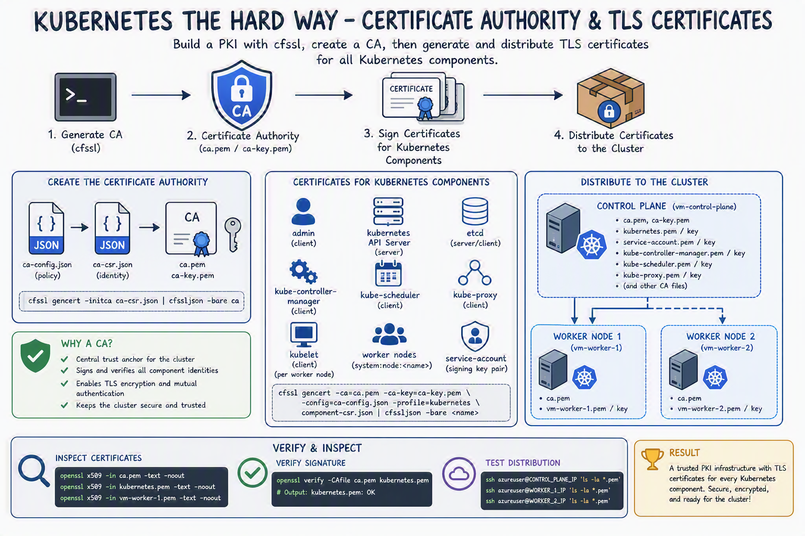

# Certificate Authority

In this lab you will provision a [PKI Infrastructure](https://en.wikipedia.org/wiki/Public_key_infrastructure) using CloudFlare's PKI toolkit, [cfssl](https://github.com/cloudflare/cfssl), then use it to bootstrap a Certificate Authority, and generate TLS certificates for the following components: etcd, kube-apiserver, kube-controller-manager, kube-scheduler, kubelet, and kube-proxy.



## Certificate Authority

In this section you will provision a Certificate Authority that can be used to generate additional TLS certificates.

**Why this is required**: Kubernetes components communicate over the network and need to verify each other's identity. A Certificate Authority (CA) acts as a trusted root that signs all component certificates. Any certificate signed by this CA can be verified by other components, establishing a chain of trust. Without this, there would be no way to securely authenticate the various components talking to each other.

Generate the CA configuration file, certificate, and private key:

```bash
# Ensure you're in the repository directory and have sourced environment variables
cd ~/kubernetes-the-hard-way-azure
source ~/k8s-env.sh

# Create certificates directory
mkdir -p certificates
cd certificates
```

### Create the CA Configuration File

**Why this is required**: This configuration file defines the policies for how certificates will be signed by the CA. The "kubernetes" profile specifies that certificates will be valid for 8760 hours (1 year) and can be used for both server authentication (proving the server's identity) and client authentication (proving the client's identity). This ensures all Kubernetes components can both serve requests securely and make authenticated requests to other components.

```bash
cat > ca-config.json << EOF
{
  "signing": {
    "default": {
      "expiry": "8760h"
    },
    "profiles": {
      "kubernetes": {
        "usages": ["signing", "key encipherment", "server auth", "client auth"],
        "expiry": "8760h"
      }
    }
  }
}
EOF
```

### Create the CA Certificate Signing Request

**Why this is required**: A Certificate Signing Request (CSR) defines the identity information that will be embedded in the CA certificate. The Common Name (CN) "Kubernetes" identifies this CA, and the organizational details provide additional context. This CSR is used to generate the self-signed root CA certificate that will be trusted by all cluster components.

```bash
cat > ca-csr.json << EOF
{
  "CN": "Kubernetes",
  "key": {
    "algo": "rsa",
    "size": 2048
  },
  "names": [
    {
      "C": "NO",
      "L": "Oslo",
      "O": "Kubernetes",
      "OU": "CA",
      "ST": "Oslo"
    }
  ]
}
EOF
```

### Generate the CA Certificate and Private Key

**Why this is required**: This command creates the actual CA certificate (`ca.pem`) and its private key (`ca-key.pem`). The CA certificate will be distributed to all nodes so they can verify certificates signed by this CA. The private key must be kept secure as it's used to sign all other certificates - anyone with access to this key could create fraudulent certificates that would be trusted by the cluster.

```bash
cfssl gencert -initca ca-csr.json | cfssljson -bare ca
```

Results:

```
ca-key.pem
ca.pem
```

## Client and Server Certificates

In this section you will generate client and server certificates for each Kubernetes component and a client certificate for the Kubernetes `admin` user.

### The Admin Client Certificate

**Why this is required**: The admin certificate is used by cluster administrators (you) to authenticate with the Kubernetes API server. The Organization (O) field is set to `system:masters`, which gives this certificate full cluster admin privileges. This certificate will be used with kubectl to perform administrative operations on the cluster.

Generate the `admin` client certificate and private key:

```bash
cat > admin-csr.json << EOF
{
  "CN": "admin",
  "key": {
    "algo": "rsa",
    "size": 2048
  },
  "names": [
    {
      "C": "NO",
      "L": "Oslo",
      "O": "system:masters",
      "OU": "Kubernetes the Hard Way",
      "ST": "Oslo"
    }
  ]
}
EOF

cfssl gencert \
  -ca=ca.pem \
  -ca-key=ca-key.pem \
  -config=ca-config.json \
  -profile=kubernetes \
  admin-csr.json | cfssljson -bare admin
```

Results:

```
admin-key.pem
admin.pem
```

### The Kubelet Client Certificates

**Why this is required**: Each worker node runs a kubelet that needs to authenticate with the API server to register the node, report status, and receive pod specifications. Kubernetes uses a [special-purpose authorization mode](https://kubernetes.io/docs/reference/access-authn-authz/node/) called Node Authorizer, that specifically authorizes API requests made by [Kubelets](https://kubernetes.io/docs/concepts/overview/components/#kubelet). The certificate's CN must follow the pattern `system:node:<nodeName>` and the O field must be `system:nodes` for the Node Authorizer to grant appropriate permissions. Each node gets a unique certificate so actions can be attributed to specific nodes. The `-hostname` flag includes both the hostname and IP address so the certificate is valid regardless of how the node is addressed.

Generate a certificate and private key for each Kubernetes worker node:

```bash
# Worker 1
cat > ${WORKER_1_HOSTNAME}-csr.json << EOF
{
  "CN": "system:node:${WORKER_1_HOSTNAME}",
  "key": {
    "algo": "rsa",
    "size": 2048
  },
  "names": [
    {
      "C": "NO",
      "L": "Oslo",
      "O": "system:nodes",
      "OU": "Kubernetes the Hard Way",
      "ST": "Oslo"
    }
  ]
}
EOF

cfssl gencert \
  -ca=ca.pem \
  -ca-key=ca-key.pem \
  -config=ca-config.json \
  -hostname=${WORKER_1_HOSTNAME},${WORKER_1_IP} \
  -profile=kubernetes \
  ${WORKER_1_HOSTNAME}-csr.json | cfssljson -bare ${WORKER_1_HOSTNAME}

# Worker 2
cat > ${WORKER_2_HOSTNAME}-csr.json << EOF
{
  "CN": "system:node:${WORKER_2_HOSTNAME}",
  "key": {
    "algo": "rsa",
    "size": 2048
  },
  "names": [
    {
      "C": "NO",
      "L": "Oslo",
      "O": "system:nodes",
      "OU": "Kubernetes the Hard Way",
      "ST": "Oslo"
    }
  ]
}
EOF

cfssl gencert \
  -ca=ca.pem \
  -ca-key=ca-key.pem \
  -config=ca-config.json \
  -hostname=${WORKER_2_HOSTNAME},${WORKER_2_IP} \
  -profile=kubernetes \
  ${WORKER_2_HOSTNAME}-csr.json | cfssljson -bare ${WORKER_2_HOSTNAME}
```

Results:

```
vm-worker-1-key.pem
vm-worker-1.pem
vm-worker-2-key.pem
vm-worker-2.pem
```

### The Controller Manager Client Certificate

**Why this is required**: The kube-controller-manager is a control plane component that runs various controllers (like the node controller, replication controller, etc.). It needs to authenticate with the API server to watch for changes and update the cluster state. The CN `system:kube-controller-manager` and O `system:kube-controller-manager` are recognized by Kubernetes RBAC to grant the controller manager the permissions it needs to manage cluster resources.

Generate the `kube-controller-manager` client certificate and private key:

```bash
cat > kube-controller-manager-csr.json << EOF
{
  "CN": "system:kube-controller-manager",
  "key": {
    "algo": "rsa",
    "size": 2048
  },
  "names": [
    {
      "C": "NO",
      "L": "Oslo",
      "O": "system:kube-controller-manager",
      "OU": "Kubernetes the Hard Way",
      "ST": "Oslo"
    }
  ]
}
EOF

cfssl gencert \
  -ca=ca.pem \
  -ca-key=ca-key.pem \
  -config=ca-config.json \
  -profile=kubernetes \
  kube-controller-manager-csr.json | cfssljson -bare kube-controller-manager
```

Results:

```
kube-controller-manager-key.pem
kube-controller-manager.pem
```

### The Kube Proxy Client Certificate

**Why this is required**: kube-proxy runs on each node and maintains network rules for service load balancing. It needs to watch the API server for service and endpoint changes. The CN `system:kube-proxy` and O `system:node-proxier` identify it to the Kubernetes RBAC system, granting it permissions to read services and endpoints but not modify them or access sensitive data.

Generate the `kube-proxy` client certificate and private key:

```bash
cat > kube-proxy-csr.json << EOF
{
  "CN": "system:kube-proxy",
  "key": {
    "algo": "rsa",
    "size": 2048
  },
  "names": [
    {
      "C": "NO",
      "L": "Oslo",
      "O": "system:node-proxier",
      "OU": "Kubernetes the Hard Way",
      "ST": "Oslo"
    }
  ]
}
EOF

cfssl gencert \
  -ca=ca.pem \
  -ca-key=ca-key.pem \
  -config=ca-config.json \
  -profile=kubernetes \
  kube-proxy-csr.json | cfssljson -bare kube-proxy
```

Results:

```
kube-proxy-key.pem
kube-proxy.pem
```

### The Scheduler Client Certificate

**Why this is required**: The kube-scheduler is responsible for assigning pods to nodes. It needs to watch for unscheduled pods and read node information from the API server, then update pod specifications with node assignments. The CN `system:kube-scheduler` and O `system:kube-scheduler` grant it the necessary RBAC permissions to perform scheduling decisions without broader cluster admin access.

Generate the `kube-scheduler` client certificate and private key:

```bash
cat > kube-scheduler-csr.json << EOF
{
  "CN": "system:kube-scheduler",
  "key": {
    "algo": "rsa",
    "size": 2048
  },
  "names": [
    {
      "C": "NO",
      "L": "Oslo",
      "O": "system:kube-scheduler",
      "OU": "Kubernetes the Hard Way",
      "ST": "Oslo"
    }
  ]
}
EOF

cfssl gencert \
  -ca=ca.pem \
  -ca-key=ca-key.pem \
  -config=ca-config.json \
  -profile=kubernetes \
  kube-scheduler-csr.json | cfssljson -bare kube-scheduler
```

Results:

```
kube-scheduler-key.pem
kube-scheduler.pem
```

### The Kubernetes API Server Certificate

**Why this is required**: The API server is the central communication hub for Kubernetes - all components talk to it. As a server, it needs a certificate to prove its identity to clients. The `kubernetes-api-server` certificate requires all names that various components may reach it to be part of the alternate names. These include the different DNS names, and IP addresses such as the master servers IP address, the load balancers IP address, the kube-api service IP address etc.

The IP `10.100.0.1` is designated as the first IP in the services subnet and will be assigned to the `kubernetes` service which is created by default. This allows pods to reach the API server via the service DNS name.

**Important**: `127.0.0.1` is required because:
- The API server connects to etcd on localhost (`https://127.0.0.1:2379`)
- kube-controller-manager and kube-scheduler connect to API server on localhost (`https://127.0.0.1:6443`)
- etcd listens on both external IP and localhost for different purposes

All these hostnames and IPs must be in the certificate's Subject Alternative Names (SAN) field, or TLS verification will fail when components try to connect using those addresses.

Generate the Kubernetes API Server certificate and private key:

```bash
cat > kubernetes-csr.json << EOF
{
  "CN": "kubernetes",
  "key": {
    "algo": "rsa",
    "size": 2048
  },
  "names": [
    {
      "C": "NO",
      "L": "Oslo",
      "O": "Kubernetes",
      "OU": "Kubernetes the Hard Way",
      "ST": "Oslo"
    }
  ]
}
EOF

cfssl gencert \
  -ca=ca.pem \
  -ca-key=ca-key.pem \
  -config=ca-config.json \
  -hostname=10.100.0.1,127.0.0.1,${CONTROL_PLANE_IP},${CONTROL_PLANE_HOSTNAME},kubernetes,kubernetes.default,kubernetes.default.svc,kubernetes.default.svc.cluster,kubernetes.default.svc.cluster.local \
  -profile=kubernetes \
  kubernetes-csr.json | cfssljson -bare kubernetes
```

Results:

```
kubernetes-key.pem
kubernetes.pem
```

## The Service Account Key Pair

**Why this is required**: When pods run in Kubernetes, they're automatically assigned a service account with an associated token. This token is used by applications inside pods to authenticate with the API server. The Kubernetes Controller Manager leverages a key pair to generate and sign service account tokens as described in the [managing service accounts](https://kubernetes.io/docs/admin/service-accounts-admin/) documentation. The API server uses the public key (from the certificate) to verify that service account tokens were legitimately signed by the controller manager. Without this, pods wouldn't be able to securely call the Kubernetes API.

Generate the `service-account` certificate and private key:

```bash
cat > service-account-csr.json << EOF
{
  "CN": "service-accounts",
  "key": {
    "algo": "rsa",
    "size": 2048
  },
  "names": [
    {
      "C": "NO",
      "L": "Oslo",
      "O": "Kubernetes",
      "OU": "Kubernetes the Hard Way",
      "ST": "Oslo"
    }
  ]
}
EOF

cfssl gencert \
  -ca=ca.pem \
  -ca-key=ca-key.pem \
  -config=ca-config.json \
  -profile=kubernetes \
  service-account-csr.json | cfssljson -bare service-account
```

Results:

```
service-account-key.pem
service-account.pem
```

## Distribute the Client and Server Certificates

**Why this is required**: Certificates need to be on the machines where they'll be used. Worker nodes need the CA certificate (to verify the API server's identity), their own kubelet certificate (to authenticate themselves), and later will need the kube-proxy certificate. The control plane needs the CA certificate and private key (to sign service account tokens), the API server certificate (to prove its identity), and the service account key pair (to generate and verify service account tokens).

Copy the appropriate certificates and private keys to each worker instance:

```bash
# Copy certificates to worker nodes
scp ca.pem vm-worker-1-key.pem vm-worker-1.pem azureuser@${WORKER_1_IP}:~/
scp ca.pem vm-worker-2-key.pem vm-worker-2.pem azureuser@${WORKER_2_IP}:~/
```

Copy the appropriate certificates and private keys to the controller instance:

```bash
# Copy certificates to control plane
scp ca.pem ca-key.pem kubernetes-key.pem kubernetes.pem \
    service-account-key.pem service-account.pem azureuser@${CONTROL_PLANE_IP}:~/
```

> The `kube-proxy`, `kube-controller-manager`, `kube-scheduler`, and `kubelet` client certificates will be used to generate client authentication configuration files in the next lab.

## Verification

**Why this is important**: Verifying the certificates ensures they were generated correctly with the right fields, expiration dates, and signatures. Catching certificate issues now prevents authentication failures later when components try to communicate. It's much easier to regenerate a certificate now than to debug TLS errors across the cluster.

List the generated certificates:

```bash
ls -la *.pem
```

You should see the following files:

```
admin-key.pem
admin.pem
ca-key.pem
ca.pem
kube-controller-manager-key.pem
kube-controller-manager.pem
kube-proxy-key.pem
kube-proxy.pem
kube-scheduler-key.pem
kube-scheduler.pem
kubernetes-key.pem
kubernetes.pem
service-account-key.pem
service-account.pem
vm-worker-1-key.pem
vm-worker-1.pem
vm-worker-2-key.pem
vm-worker-2.pem
```

### Verify Certificate Information

You can inspect any certificate to verify its information:

```bash
# Check the CA certificate
openssl x509 -in ca.pem -text -noout

# Check the Kubernetes API server certificate
openssl x509 -in kubernetes.pem -text -noout

# Check a worker node certificate
openssl x509 -in vm-worker-1.pem -text -noout
```

### Test Certificate Distribution

Verify that certificates were copied to the VMs:

```bash
# Check control plane
ssh azureuser@${CONTROL_PLANE_IP} 'ls -la *.pem'

# Check worker nodes
ssh azureuser@${WORKER_1_IP} 'ls -la *.pem'
ssh azureuser@${WORKER_2_IP} 'ls -la *.pem'
```

## Troubleshooting

### Certificate Generation Issues

If certificate generation fails:

1. Verify cfssl is installed: `cfssl version`
2. Check the JSON syntax in CSR files: `cat filename.json | jq .`
3. Ensure the CA files exist: `ls -la ca.pem ca-key.pem`

### File Copy Issues

If scp fails:

1. Test SSH connectivity: `ssh azureuser@${CONTROL_PLANE_IP} 'hostname'`
2. Check SSH key permissions: `ls -la ~/.ssh/id_rsa`
3. Try copying files one by one to identify the issue

### Certificate Verification

To verify a certificate was signed by the CA:

```bash
openssl verify -CAfile ca.pem kubernetes.pem
```

Next: [Kubernetes Configuration Files](03-kubernetes-configuration-files.md)