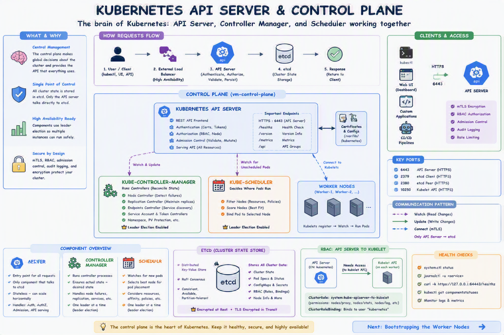

# Bootstrapping the Kubernetes Control Plane

In this lab you will bootstrap the Kubernetes control plane across a single compute instance and configure it for high availability. You will also create an external load balancer that exposes the Kubernetes API Servers to remote clients. The following components will be installed on the control plane node: Kubernetes API Server, Scheduler, and Controller Manager.

**Why this matters**: The control plane is the brain of Kubernetes. It makes global decisions about the cluster (scheduling, detecting events, responding to node failures) and provides the API that all other components and users interact with. Without a functioning control plane, you have no Kubernetes cluster—just isolated machines running containers.



## Prerequisites

**Why this is required**: All control plane components must be installed on the same machine where etcd is running. They need to communicate with etcd via localhost (127.0.0.1) for performance and security. Installing them elsewhere would require exposing etcd over the network, which is a security risk.

The commands in this lab must be run on the control plane instance: `vm-control-plane`. Login to the control plane instance using SSH from the jumpbox:

```bash
# From the jumpbox, connect to the control plane
ssh azureuser@10.0.3.10
```

## Provision the Kubernetes Control Plane

**Why this is required**: Kubernetes components need a standard location for configuration files. Following Linux conventions, `/etc/kubernetes/config` stores cluster-wide configuration that all components can reference.

Create the Kubernetes configuration directory:

```bash
sudo mkdir -p /etc/kubernetes/config
```

### Download and Install the Kubernetes Controller Binaries

**Why this is required**: The control plane consists of three main binaries that work together to manage the cluster. We're downloading version 1.28.0 which is stable and production-ready:
- **kube-apiserver**: The REST API frontend that all components talk to
- **kube-controller-manager**: Runs controllers that handle node failures, replication, endpoints, etc.
- **kube-scheduler**: Decides which nodes should run which pods
- **kubectl**: Command-line tool for cluster administration (we'll use this for setup and verification)

Download the official Kubernetes release binaries:

```bash
wget -q --show-progress --https-only --timestamping "https://storage.googleapis.com/kubernetes-release/release/v1.28.0/bin/linux/amd64/kube-apiserver" "https://storage.googleapis.com/kubernetes-release/release/v1.28.0/bin/linux/amd64/kube-controller-manager" "https://storage.googleapis.com/kubernetes-release/release/v1.28.0/bin/linux/amd64/kube-scheduler" "https://storage.googleapis.com/kubernetes-release/release/v1.28.0/bin/linux/amd64/kubectl"
```

Install the Kubernetes binaries:

```bash
chmod +x kube-apiserver kube-controller-manager kube-scheduler kubectl
sudo mv kube-apiserver kube-controller-manager kube-scheduler kubectl /usr/local/bin/
```

### Configure the Kubernetes API Server

**Why this is required**: The API server needs multiple certificates and configuration files to operate securely. These files authenticate components, encrypt data at rest, and establish trust relationships throughout the cluster.

```bash
# Create directory for Kubernetes secrets and certificates
sudo mkdir -p /var/lib/kubernetes/

# Copy all required certificates and configuration:
# - ca.pem / ca-key.pem: Sign service account tokens and verify component certificates
# - kubernetes.pem / kubernetes-key.pem: API server's TLS certificate and key
# - service-account.pem / service-account-key.pem: Sign and verify service account tokens
# - encryption-config.yaml: Defines how secrets are encrypted in etcd
sudo cp ca.pem ca-key.pem kubernetes-key.pem kubernetes.pem service-account-key.pem service-account.pem encryption-config.yaml /var/lib/kubernetes/
```

The instance internal IP address will be used to advertise the API Server to members of the cluster. Retrieve the internal IP address for the current compute instance:

```bash
# This IP will be advertised to all cluster members (worker nodes, kubectl clients)
# so they know where to reach the API server
INTERNAL_IP=$(ip addr show eth0 | grep -oP '(?<=inet\s)\d+(\.\d+){3}')
echo "Internal IP: $INTERNAL_IP"
```

**Important**: Ensure `INTERNAL_IP` is set correctly before creating the service file. If this variable is empty, the API server will fail to start with "failed to parse IP" errors.

Create the `kube-apiserver.service` systemd unit file:

**Why this is required**: The API server is the most complex component with dozens of configuration flags. Each flag controls a critical aspect of cluster operation. Understanding these flags helps troubleshoot issues and make informed configuration choices.

**Key API Server flags explained**:
- `--advertise-address`: IP that other components use to reach this API server (must be reachable from worker nodes)
- `--allow-privileged`: Enables privileged containers (needed for system components like kube-proxy)
- `--authorization-mode=Node,RBAC`: Node Authorizer for kubelets, RBAC for everything else
- `--bind-address=0.0.0.0`: Listen on all interfaces (so workers can connect via private IP)
- `--client-ca-file`: CA certificate to verify client certificates (mutual TLS)
- `--enable-admission-plugins`: Admission controllers that intercept requests before persistence:
  - **NamespaceLifecycle**: Prevents operations on terminating namespaces
  - **NodeRestriction**: Limits what kubelets can modify
  - **LimitRanger**: Enforces resource limits
  - **ServiceAccount**: Automatically injects service account tokens into pods
  - **DefaultStorageClass**: Sets default storage class for PVCs
  - **ResourceQuota**: Enforces resource quotas per namespace
- `--etcd-servers=https://127.0.0.1:2379`: Connect to etcd on localhost (secure and fast)
- `--encryption-provider-config`: Encrypts secrets at rest in etcd
- `--kubelet-certificate-authority`: CA to verify kubelet certificates when connecting to them
- `--service-account-*`: Configuration for signing and verifying service account tokens
- `--service-cluster-ip-range`: CIDR for service IPs (internal cluster IPs, not pod IPs)
- `--service-node-port-range`: Port range for NodePort services (30000-32767)
- `--tls-cert-file` / `--tls-private-key-file`: API server's own TLS certificate

```bash
cat <<EOF | sudo tee /etc/systemd/system/kube-apiserver.service
[Unit]
Description=Kubernetes API Server
Documentation=https://github.com/kubernetes/kubernetes

[Service]
ExecStart=/usr/local/bin/kube-apiserver --advertise-address=${INTERNAL_IP} --allow-privileged=true --apiserver-count=1 --audit-log-maxage=30 --audit-log-maxbackup=3 --audit-log-maxsize=100 --audit-log-path=/var/log/audit.log --authorization-mode=Node,RBAC --bind-address=0.0.0.0 --client-ca-file=/var/lib/kubernetes/ca.pem --enable-admission-plugins=NamespaceLifecycle,NodeRestriction,LimitRanger,ServiceAccount,DefaultStorageClass,ResourceQuota --etcd-cafile=/var/lib/kubernetes/ca.pem --etcd-certfile=/var/lib/kubernetes/kubernetes.pem --etcd-keyfile=/var/lib/kubernetes/kubernetes-key.pem --etcd-servers=https://127.0.0.1:2379 --event-ttl=1h --encryption-provider-config=/var/lib/kubernetes/encryption-config.yaml --kubelet-certificate-authority=/var/lib/kubernetes/ca.pem --kubelet-client-certificate=/var/lib/kubernetes/kubernetes.pem --kubelet-client-key=/var/lib/kubernetes/kubernetes-key.pem --runtime-config='api/all=true' --service-account-key-file=/var/lib/kubernetes/service-account.pem --service-account-signing-key-file=/var/lib/kubernetes/service-account-key.pem --service-account-issuer=https://${INTERNAL_IP}:6443 --service-cluster-ip-range=10.100.0.0/16 --service-node-port-range=30000-32767 --tls-cert-file=/var/lib/kubernetes/kubernetes.pem --tls-private-key-file=/var/lib/kubernetes/kubernetes-key.pem --v=2
Restart=on-failure
RestartSec=5

[Install]
WantedBy=multi-user.target
EOF
```

### Configure the Kubernetes Controller Manager

**Why this is required**: The controller manager runs multiple controllers (each in a separate goroutine) that watch the cluster state via the API server and make changes to move the current state toward the desired state. Controllers handle node lifecycle, pod replication, service endpoints, and service account token generation.

Move the `kube-controller-manager` kubeconfig into place:

```bash
# The kubeconfig contains the API server address and credentials
# for the controller manager to authenticate
sudo cp kube-controller-manager.kubeconfig /var/lib/kubernetes/
```

Create the `kube-controller-manager.service` systemd unit file:

**Key Controller Manager flags explained**:
- `--cluster-cidr=10.200.0.0/16`: CIDR range for pod IPs (used by node IPAM controller to allocate pod subnets to nodes)
- `--cluster-signing-cert-file` / `--cluster-signing-key-file`: CA certificate and key to sign kubelet certificates during TLS bootstrapping
- `--kubeconfig`: Configuration file with API server location and authentication credentials
- `--leader-elect=true`: Enables leader election (important for HA, only one controller manager is active at a time)
- `--root-ca-file`: CA certificate added to service account tokens so pods can verify API server
- `--service-account-private-key-file`: Private key used to sign service account tokens
- `--service-cluster-ip-range`: Same as API server, used for service IPAM controller
- `--use-service-account-credentials=true`: Each controller uses its own service account (principle of least privilege)

```bash
cat <<EOF | sudo tee /etc/systemd/system/kube-controller-manager.service
[Unit]
Description=Kubernetes Controller Manager
Documentation=https://github.com/kubernetes/kubernetes

[Service]
ExecStart=/usr/local/bin/kube-controller-manager --bind-address=0.0.0.0 --cluster-cidr=10.200.0.0/16 --cluster-name=kubernetes --cluster-signing-cert-file=/var/lib/kubernetes/ca.pem --cluster-signing-key-file=/var/lib/kubernetes/ca-key.pem --kubeconfig=/var/lib/kubernetes/kube-controller-manager.kubeconfig --leader-elect=true --root-ca-file=/var/lib/kubernetes/ca.pem --service-account-private-key-file=/var/lib/kubernetes/service-account-key.pem --service-cluster-ip-range=10.100.0.0/16 --use-service-account-credentials=true --v=2
Restart=on-failure
RestartSec=5

[Install]
WantedBy=multi-user.target
EOF
```

### Configure the Kubernetes Scheduler

**Why this is required**: The scheduler watches for newly created pods (pods without a node assignment) and selects a node for them to run on. The scheduler considers resource requirements, hardware/software/policy constraints, affinity/anti-affinity rules, data locality, and workload interference. Without the scheduler, pods remain in "Pending" state forever.

Move the `kube-scheduler` kubeconfig into place:

```bash
# The kubeconfig contains API server location and authentication
sudo cp kube-scheduler.kubeconfig /var/lib/kubernetes/
```

Create the `kube-scheduler.yaml` configuration file:

**Why this format**: Starting in Kubernetes 1.23+, the scheduler uses a structured configuration file (YAML) instead of command-line flags. This provides better validation and easier configuration management.

```bash
cat <<EOF | sudo tee /etc/kubernetes/config/kube-scheduler.yaml
apiVersion: kubescheduler.config.k8s.io/v1beta3
kind: KubeSchedulerConfiguration
clientConnection:
  kubeconfig: "/var/lib/kubernetes/kube-scheduler.kubeconfig"
leaderElection:
  leaderElect: true
EOF
```

Create the `kube-scheduler.service` systemd unit file:

```bash
cat <<EOF | sudo tee /etc/systemd/system/kube-scheduler.service
[Unit]
Description=Kubernetes Scheduler
Documentation=https://github.com/kubernetes/kubernetes

[Service]
ExecStart=/usr/local/bin/kube-scheduler --config=/etc/kubernetes/config/kube-scheduler.yaml --v=2
Restart=on-failure
RestartSec=5

[Install]
WantedBy=multi-user.target
EOF
```

### Start the Controller Services

**Why this is required**: Now that all configuration files and systemd units are in place, we can start the control plane components. The order matters: the API server must start first (since controller-manager and scheduler connect to it), but systemd's dependency management and restart policies handle this automatically.

**Understanding the startup sequence**:
1. **daemon-reload**: Tells systemd to reload all unit files (so it sees our new service definitions)
2. **enable**: Creates symlinks so services start automatically on boot (critical for cluster resilience)
3. **start**: Starts the services immediately

```bash
sudo systemctl daemon-reload
sudo systemctl enable kube-apiserver kube-controller-manager kube-scheduler
sudo systemctl start kube-apiserver kube-controller-manager kube-scheduler
```

> Allow up to 10 seconds for the Kubernetes API Server to fully initialize. The API server needs time to connect to etcd, load initial resources, and start serving requests. The controller manager and scheduler will retry connections until the API server is ready.

## Verification

**Why this is important**: Verification ensures all three control plane components are running before proceeding to worker node setup. The cluster is non-functional if any control plane component is down. Catching issues now prevents wasting time configuring worker nodes that won't be able to join the cluster.

### Check Service Status

```bash
# Check that all services are running
sudo systemctl status kube-apiserver kube-controller-manager kube-scheduler

# Check service logs
sudo journalctl -u kube-apiserver
sudo journalctl -u kube-controller-manager  
sudo journalctl -u kube-scheduler
```

### Test the Kubernetes API Server

```bash
# Test API server locally
curl --cacert /var/lib/kubernetes/ca.pem https://127.0.0.1:6443/version

# Test with kubectl (once configured)
kubectl cluster-info --kubeconfig admin.kubeconfig
```

### Troubleshooting Common Issues

**Issue: "invalid argument "" for "--advertise-address" flag: failed to parse IP: """**
- The `${INTERNAL_IP}` variable was not expanded in the service file
- Service file contains literal `${INTERNAL_IP}` instead of actual IP address
- This usually happens when the variable wasn't set before creating the service

**Common causes:**
- Didn't set `INTERNAL_IP` variable before creating service file
- Variable lost scope when using `sudo` commands
- Copy-pasted the service creation without setting the variable first

**Solution:**
```bash
# Check current service file for unexpanded variables
sudo cat /etc/systemd/system/kube-apiserver.service | grep advertise-address

# If you see ${INTERNAL_IP} instead of actual IP, recreate the service file
INTERNAL_IP=$(ip addr show eth0 | grep -oP '(?<=inet\s)\d+(\.\d+){3}')
echo "INTERNAL_IP should be: $INTERNAL_IP"

# Recreate the service file with actual IP values
cat <<EOF | sudo tee /etc/systemd/system/kube-apiserver.service
[Unit]
Description=Kubernetes API Server
Documentation=https://github.com/kubernetes/kubernetes

[Service]
ExecStart=/usr/local/bin/kube-apiserver --advertise-address=${INTERNAL_IP} --allow-privileged=true --apiserver-count=1 --audit-log-maxage=30 --audit-log-maxbackup=3 --audit-log-maxsize=100 --audit-log-path=/var/log/audit.log --authorization-mode=Node,RBAC --bind-address=0.0.0.0 --client-ca-file=/var/lib/kubernetes/ca.pem --enable-admission-plugins=NamespaceLifecycle,NodeRestriction,LimitRanger,ServiceAccount,DefaultStorageClass,ResourceQuota --etcd-cafile=/var/lib/kubernetes/ca.pem --etcd-certfile=/var/lib/kubernetes/kubernetes.pem --etcd-keyfile=/var/lib/kubernetes/kubernetes-key.pem --etcd-servers=https://127.0.0.1:2379 --event-ttl=1h --encryption-provider-config=/var/lib/kubernetes/encryption-config.yaml --kubelet-certificate-authority=/var/lib/kubernetes/ca.pem --kubelet-client-certificate=/var/lib/kubernetes/kubernetes.pem --kubelet-client-key=/var/lib/kubernetes/kubernetes-key.pem --runtime-config='api/all=true' --service-account-key-file=/var/lib/kubernetes/service-account.pem --service-account-signing-key-file=/var/lib/kubernetes/service-account-key.pem --service-account-issuer=https://${INTERNAL_IP}:6443 --service-cluster-ip-range=10.100.0.0/16 --service-node-port-range=30000-32767 --tls-cert-file=/var/lib/kubernetes/kubernetes.pem --tls-private-key-file=/var/lib/kubernetes/kubernetes-key.pem --v=2
Restart=on-failure
RestartSec=5

[Install]
WantedBy=multi-user.target
EOF

# Reload and restart the API server
sudo systemctl daemon-reload
sudo systemctl restart kube-apiserver

# Check if it's now working
sudo systemctl status kube-apiserver
sudo journalctl -u kube-apiserver --no-pager | tail -10
```

**Issue: "connection refused" when testing API server**
- API server may still be starting up
- Check if etcd is running and accessible

**Solution:**
```bash
# Verify etcd is running and accessible
sudo systemctl status etcd
curl -k https://127.0.0.1:2379/health

# Check API server logs for specific errors
sudo journalctl -u kube-apiserver --no-pager | tail -20

# Wait a bit more for startup (API server can take 30+ seconds)
sleep 30
curl --cacert /var/lib/kubernetes/ca.pem https://127.0.0.1:6443/version
```

## RBAC for Kubelet Authorization

**Why this is required**: By default, the API server has no permissions to talk to the kubelet API running on each worker node. However, the API server needs to connect to kubelets to:
- Retrieve pod logs (`kubectl logs`)
- Execute commands in containers (`kubectl exec`)
- Retrieve metrics for monitoring and scheduling decisions
- Forward ports (`kubectl port-forward`)
- Get pod status and resource usage

Without this RBAC configuration, these essential kubectl commands won't work. The API server authenticates to kubelets using the client certificate with CN "kubernetes" (the one we generated in the certificate lab).

In this section you will configure RBAC permissions to allow the Kubernetes API Server to access the Kubelet API on each worker node. Access to the Kubelet API is required for retrieving metrics, logs, and executing commands in pods.

> The commands in this section will effect the entire cluster and only need to be run once from one of the controller nodes.

From the jumpbox, create the `system:kube-apiserver-to-kubelet` [ClusterRole](https://kubernetes.io/docs/reference/access-authn-authz/rbac/#role-and-clusterrole) with permissions to access the Kubelet API and perform most common tasks associated with managing pods:

**Understanding the RBAC resources**:
- **ClusterRole**: Defines permissions (what actions are allowed on which resources)
- **ClusterRoleBinding**: Grants those permissions to a specific user (in this case, the "kubernetes" user which is the CN in the API server's client certificate)

```bash
# From the jumpbox, configure kubectl to connect to the API server
cd ~/kubernetes-the-hard-way-azure/certificates

# Set up kubectl configuration
kubectl config set-cluster kubernetes-the-hard-way --certificate-authority=ca.pem --embed-certs=true --server=https://10.0.3.10:6443

kubectl config set-credentials admin --client-certificate=admin.pem --client-key=admin-key.pem

kubectl config set-context kubernetes-the-hard-way --cluster=kubernetes-the-hard-way --user=admin

kubectl config use-context kubernetes-the-hard-way

# Test connection
kubectl cluster-info
kubectl get componentstatuses
```

Create the ClusterRole and ClusterRoleBinding:

```bash
cat <<EOF | kubectl apply -f -
apiVersion: rbac.authorization.k8s.io/v1
kind: ClusterRole
metadata:
  annotations:
    rbac.authorization.kubernetes.io/autoupdate: "true"
  labels:
    kubernetes.io/bootstrapping: rbac-defaults
  name: system:kube-apiserver-to-kubelet
rules:
  - apiGroups:
      - ""
    resources:
      - nodes/proxy
      - nodes/stats
      - nodes/log
      - nodes/spec
      - nodes/metrics
    verbs:
      - "*"
EOF

cat <<EOF | kubectl apply -f -
apiVersion: rbac.authorization.k8s.io/v1
kind: ClusterRoleBinding
metadata:
  name: system:kube-apiserver
  namespace: ""
roleRef:
  apiGroup: rbac.authorization.k8s.io
  kind: ClusterRole
  name: system:kube-apiserver-to-kubelet
subjects:
  - apiGroup: rbac.authorization.k8s.io
    kind: User
    name: kubernetes
EOF
```

## Understanding the Control Plane Components

**Why this matters**: Understanding how the control plane components work together helps you troubleshoot issues, optimize performance, and make informed architectural decisions. Each component has a specific responsibility, and they communicate exclusively through the API server.

### API Server
- **Purpose**: Central management entity and communication hub—the only component that talks directly to etcd
- **Functions**: 
  - **Authentication**: Verifies who you are (certificates, tokens, basic auth)
  - **Authorization**: Decides what you can do (RBAC, Node authorization)
  - **Admission Control**: Validates and mutates requests before persisting (sets defaults, enforces policies)
  - **Serving the API**: REST endpoints for all Kubernetes resources
- **Port**: 6443 (HTTPS)
- **Dependencies**: etcd for data storage (all cluster state is persisted in etcd)
- **Communication pattern**: Stateless—can be scaled horizontally behind a load balancer

### Controller Manager
- **Purpose**: Runs controller processes (background threads) that act on the cluster state
- **Functions**: Each controller watches for changes and reconciles actual state with desired state:
  - **Node controller**: Detects and responds to node failures (marks nodes as unhealthy, evicts pods)
  - **Replication controller**: Ensures the correct number of pod replicas exist
  - **Endpoints controller**: Populates Endpoints objects (joins Services and Pods)
  - **Service Account & Token controllers**: Creates default service accounts and API access tokens for new namespaces
  - **Namespace controller**: Cleans up resources when namespaces are deleted
  - **PV protection controller**: Prevents deletion of PVs in active use
- **Communication**: Connects to API server to watch resources and submit changes
- **Dependencies**: API server availability (retries until API server is ready)
- **Leadership**: Uses leader election in HA setups—only one active controller manager at a time

### Scheduler
- **Purpose**: Watches for newly created pods (pods without `.spec.nodeName`) and assigns them to nodes
- **Functions**: 
  - **Filtering**: Excludes nodes that don't meet pod requirements (resources, taints, affinity)
  - **Scoring**: Ranks remaining nodes by priority (spread pods, prefer less-loaded nodes)
  - **Binding**: Updates the pod with selected node name
- **Algorithm**: Two-phase process—filtering removes impossible nodes, scoring ranks feasible ones
- **Dependencies**: API server availability
- **Extensibility**: Supports custom schedulers (you can run multiple schedulers in one cluster)
- **Leadership**: Uses leader election in HA setups—only one active scheduler at a time

### How They Work Together
1. A user submits a pod via `kubectl` → API server
2. API server authenticates, authorizes, validates, and persists to etcd
3. **Scheduler** watches API server, sees new pod without node assignment
4. Scheduler selects best node and updates pod spec with node name
5. Kubelet on that node sees pod assigned to it, pulls images, starts containers
6. **Controller Manager** continuously watches all resources, taking corrective action when actual state drifts from desired state
7. All status updates flow back through the API server to etcd

**Key insight**: Only the API server talks to etcd. Every other component (including kubelets on worker nodes) watches and updates resources through the API server's REST API. This design keeps the architecture clean and makes it possible to scale the API server horizontally.

## Security Considerations

**Why this matters**: Kubernetes security is layered and defense-in-depth. Multiple security mechanisms work together to protect the cluster from both external attackers and internal misconfigurations. Understanding these layers helps you assess risk and implement appropriate controls.

### TLS Configuration
- All components communicate via TLS (encrypted in transit)
- Mutual TLS (mTLS) between components (both client and server authenticate each other)
- Certificate-based authentication (more secure than passwords or bearer tokens)
- **Why it matters**: Prevents eavesdropping, man-in-the-middle attacks, and unauthorized component impersonation. Even if an attacker gains network access, they cannot intercept traffic or impersonate components without valid certificates.

### RBAC
- Role-Based Access Control enabled (--authorization-mode=RBAC)
- Principle of least privilege (each component has only the permissions it needs)
- Service account automation (pods automatically get credentials scoped to their needs)
- **Why it matters**: Limits blast radius of compromised components. If a pod is compromised, the attacker can only perform actions granted to that pod's service account, not cluster-wide operations.

### Audit Logging
- API server actions are audited (who did what, when)
- Logs stored in `/var/log/audit.log`
- Configurable audit policies (can filter by verb, resource, user)
- **Why it matters**: Provides forensic evidence for security incidents, helps detect anomalous behavior, and supports compliance requirements (SOC 2, PCI-DSS, etc.). You can see exactly who created/deleted/modified which resources.

### Admission Control
- Admission controllers intercept requests before persisting to etcd
- Can reject requests (e.g., LimitRanger rejects pods exceeding namespace limits)
- Can mutate requests (e.g., ServiceAccount automatically adds tokens to pods)
- **Why it matters**: Enforces organizational policies at the API level. Even cluster admins cannot bypass admission controllers without modifying the API server configuration, preventing accidental or malicious violations of resource quotas, security policies, etc.

### Encryption at Rest
- Secrets encrypted in etcd using encryption-config.yaml
- Application-layer encryption (etcd stores encrypted data, never sees plaintext)
- **Why it matters**: If an attacker gains access to etcd's data files on disk or steals an etcd backup, they cannot read secret values without the encryption key. This protects sensitive data like database passwords, API keys, and TLS private keys.

## Troubleshooting

### Service Won't Start

If a service fails to start:

1. Check systemd status: `sudo systemctl status [service-name]`
2. View logs: `sudo journalctl -u [service-name] --no-pager`
3. Check certificate files: `ls -la /var/lib/kubernetes/`
4. Verify port availability: `sudo netstat -tlnp | grep [port]`

### API Server Issues

Common API server problems:

```bash
# Check if API server is responding
curl -k https://127.0.0.1:6443/healthz

# Check certificate validity
openssl x509 -in /var/lib/kubernetes/kubernetes.pem -text -noout

# Check etcd connectivity
sudo ETCDCTL_API=3 etcdctl --endpoints=https://127.0.0.1:2379 --cacert=/etc/etcd/ca.pem --cert=/etc/etcd/kubernetes.pem --key=/etc/etcd/kubernetes-key.pem endpoint health
```

### Controller Manager Issues

```bash
# Check controller manager logs
sudo journalctl -u kube-controller-manager -f

# Verify kubeconfig
kubectl config view --kubeconfig=/var/lib/kubernetes/kube-controller-manager.kubeconfig
```

### Scheduler Issues

```bash
# Check scheduler logs
sudo journalctl -u kube-scheduler -f

# Test scheduler config
kubectl config view --kubeconfig=/var/lib/kubernetes/kube-scheduler.kubeconfig
```

## Monitoring and Maintenance

### Health Checks

Create a health check script:

```bash
cat > ~/check-control-plane.sh << 'EOF'
#!/bin/bash

echo "=== Control Plane Health Check ==="

# Check systemd services
echo "Service Status:"
for service in kube-apiserver kube-controller-manager kube-scheduler; do
    if systemctl is-active --quiet $service; then
        echo "✓ $service is running"
    else
        echo "✗ $service is not running"
    fi
done

# Check API server
echo -e "\nAPI Server:"
if curl -k -s https://127.0.0.1:6443/healthz | grep -q "ok"; then
    echo "✓ API server is healthy"
else
    echo "✗ API server is not responding"
fi

# Check component status
echo -e "\nComponent Status:"
kubectl get componentstatuses 2>/dev/null || echo "Unable to get component status"

echo -e "\nCheck complete."
EOF

chmod +x ~/check-control-plane.sh
```

Next: [Bootstrapping the Kubernetes Worker Nodes](07-bootstrapping-kubernetes-workers.md)