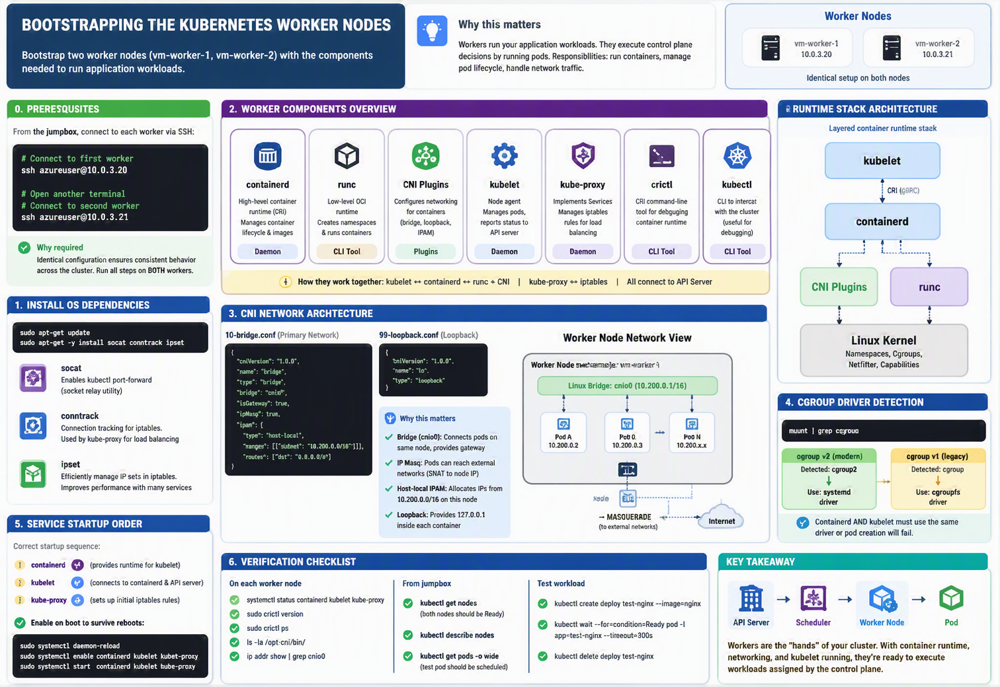

# Bootstrapping the Kubernetes Worker Nodes

In this lab you will bootstrap two Kubernetes worker nodes. The following components will be installed on each node: [runc](https://github.com/opencontainers/runc), [container networking plugins](https://github.com/containernetworking/cni), [containerd](https://github.com/containerd/containerd), [kubelet](https://kubernetes.io/docs/admin/kubelet), and [kube-proxy](https://kubernetes.io/docs/concepts/cluster-administration/proxies).

**Why this matters**: Worker nodes are where your actual application workloads run. While the control plane makes decisions, workers execute those decisions by running pods. Each worker node has three main responsibilities: running containers (containerd/runc), managing pod lifecycle (kubelet), and handling network traffic (kube-proxy + CNI). Without functioning worker nodes, your cluster is just a brain with no hands—it can make decisions but can't execute any actual work.



## Prerequisites

**Why this is required**: Worker nodes must be configured identically to ensure consistent behavior across the cluster. When the scheduler assigns a pod to a node, it expects all nodes to have the same basic capabilities. Running these commands on both workers ensures they can both run pods, connect to the API server, and participate in cluster networking.

The commands in this lab must be run on each worker instance: `vm-worker-1` and `vm-worker-2`. Login to each worker instance using SSH from the jumpbox.

```bash
# From the jumpbox, connect to the first worker
ssh azureuser@10.0.3.20

# Open another terminal and connect to the second worker
ssh azureuser@10.0.3.21
```

> The following commands should be run on both worker nodes unless otherwise specified.

> **Important**: This setup automatically detects your system's cgroup version (v1 or v2) and configures containerd and kubelet accordingly. Modern Ubuntu 22.04+ systems use cgroup v2 by default, which requires systemd cgroup driver configuration.

## Provisioning a Kubernetes Worker Node

**Why this is required**: Worker nodes need specific system packages to support Kubernetes networking and debugging capabilities. These are not part of the default Ubuntu installation.

Install the OS dependencies:

```bash
sudo apt-get update
sudo apt-get -y install socat conntrack ipset
```

**Understanding the dependencies**:
- **socat**: Socket relay utility that enables `kubectl port-forward` (lets you tunnel traffic from your machine to a pod)
- **conntrack**: Connection tracking tool for iptables—kube-proxy uses this to track network connections for service load balancing
- **ipset**: Efficiently manage sets of IP addresses in iptables rules—improves performance when you have many services

### Configure System Settings for Container Networking

**Why this is required**: By default, Linux does not forward packets between network interfaces. Worker nodes need to route traffic from pod networks (cnio0 bridge) to external networks (eth0). Without IP forwarding enabled, pods cannot reach the internet or communicate across nodes.

**Understanding IP forwarding**: When a pod sends a packet to an external destination (e.g., 8.8.8.8), the packet arrives at the node's cnio0 bridge interface. The node must forward it to the eth0 interface (and vice versa for return traffic). The `net.ipv4.ip_forward` kernel parameter controls this behavior.

Enable IP forwarding:

```bash
# Enable IP forwarding immediately
sudo sysctl -w net.ipv4.ip_forward=1

# Make it persistent across reboots
echo "net.ipv4.ip_forward=1" | sudo tee -a /etc/sysctl.conf

# Verify it's enabled (should show: net.ipv4.ip_forward = 1)
sudo sysctl net.ipv4.ip_forward
```

**Security note**: IP forwarding is required for Kubernetes nodes but should only be enabled on systems that need to route traffic (like Kubernetes workers and routers).

### Download and Install Worker Binaries

**Why this is required**: Worker nodes need a complete container runtime stack plus Kubernetes components. This is more complex than the control plane because workers actually run containers.

**Understanding what we're downloading**:
- **crictl**: Command-line tool for interacting with CRI-compliant container runtimes (for debugging)
- **runc**: Low-level container runtime that actually creates and runs containers (OCI-compliant)
- **cni-plugins**: Network plugins that set up networking for containers (bridge, loopback, etc.)
- **containerd**: High-level container runtime that manages container lifecycle and images
- **kubectl**: CLI tool for interacting with the cluster (useful for local debugging)
- **kube-proxy**: Network proxy that maintains iptables rules for service load balancing
- **kubelet**: Primary node agent that manages pods and talks to the API server

```bash
wget -q --show-progress --https-only --timestamping https://github.com/kubernetes-sigs/cri-tools/releases/download/v1.28.0/crictl-v1.28.0-linux-amd64.tar.gz https://github.com/opencontainers/runc/releases/download/v1.1.8/runc.amd64 https://github.com/containernetworking/plugins/releases/download/v1.3.0/cni-plugins-linux-amd64-v1.3.0.tgz https://github.com/containerd/containerd/releases/download/v1.7.2/containerd-1.7.2-linux-amd64.tar.gz https://storage.googleapis.com/kubernetes-release/release/v1.28.0/bin/linux/amd64/kubectl https://storage.googleapis.com/kubernetes-release/release/v1.28.0/bin/linux/amd64/kube-proxy https://storage.googleapis.com/kubernetes-release/release/v1.28.0/bin/linux/amd64/kubelet
```

Create the installation directories:

**Why this is required**: Each component needs specific directories for configuration, data, and runtime state. Following Linux Filesystem Hierarchy Standard conventions:

```bash
# Create all required directories:
# /etc/cni/net.d - CNI network configuration files
# /opt/cni/bin - CNI plugin binaries
# /var/lib/kubelet - Kubelet data (pod specs, volumes, etc.)
# /var/lib/kube-proxy - kube-proxy configuration
# /var/lib/kubernetes - Kubernetes certificates and secrets
# /var/run/kubernetes - Runtime state and sockets
sudo mkdir -p /etc/cni/net.d /opt/cni/bin /var/lib/kubelet /var/lib/kube-proxy /var/lib/kubernetes /var/run/kubernetes
```

Install the worker binaries:

```bash
mkdir containerd
tar -xvf crictl-v1.28.0-linux-amd64.tar.gz
tar -xvf containerd-1.7.2-linux-amd64.tar.gz -C containerd
sudo tar -xvf cni-plugins-linux-amd64-v1.3.0.tgz -C /opt/cni/bin/
sudo mv runc.amd64 runc
chmod +x crictl kubectl kube-proxy kubelet runc 
sudo mv crictl kubectl kube-proxy kubelet runc /usr/local/bin/
sudo mv containerd/bin/* /usr/local/bin/
```

Configure crictl to use containerd:

```bash
# Method 1: Use crictl config command (recommended)
sudo crictl config --set runtime-endpoint=unix:///run/containerd/containerd.sock
sudo crictl config --set image-endpoint=unix:///run/containerd/containerd.sock

# Method 2: Create config file manually (alternative)
sudo mkdir -p /etc/crictl
cat <<EOF | sudo tee /etc/crictl/crictl.yaml
runtime-endpoint: unix:///run/containerd/containerd.sock
image-endpoint: unix:///run/containerd/containerd.sock
timeout: 2
debug: false
pull-image-on-create: false
disable-pull-on-run: false
EOF
```

### Configure CNI Networking

**Why this is required**: CNI (Container Network Interface) plugins set up networking when containers start. Without CNI, pods on this node wouldn't be able to communicate with each other or with pods on other nodes. The CNI plugins create virtual network interfaces, assign IP addresses, and configure routes.

**Understanding the architecture**: Each worker node gets a subset of the pod CIDR range (10.200.0.0/16). In a more advanced setup, each node would get a unique /24 subnet (e.g., worker-1 gets 10.200.1.0/24, worker-2 gets 10.200.2.0/24). For simplicity, we're using the full range on both nodes.

Retrieve the Pod CIDR range for the current compute instance:

```bash
POD_CIDR="10.200.0.0/16"
echo "Pod CIDR: $POD_CIDR"
```

Create the `bridge` network configuration file:

**Why this configuration**: The bridge plugin creates a Linux bridge (like a virtual switch) called `cnio0` on the node. All pod network interfaces connect to this bridge, allowing pods on the same node to communicate. The configuration also sets up IP masquerading (SNAT) so pods can reach external networks.

**Understanding the settings**:
- **isGateway: true**: Makes the bridge the default gateway for pods
- **ipMasq: true**: Enables IP masquerading for traffic leaving the node (pods appear to have the node's IP)
- **ipam.type: host-local**: IP addresses are allocated and tracked locally on this node
- **routes**: All traffic (0.0.0.0/0) goes through the bridge gateway

```bash
cat <<EOF | sudo tee /etc/cni/net.d/10-bridge.conf
{
    "cniVersion": "1.0.0",
    "name": "bridge",
    "type": "bridge",
    "bridge": "cnio0",
    "isGateway": true,
    "ipMasq": true,
    "ipam": {
        "type": "host-local",
        "ranges": [
          [{"subnet": "${POD_CIDR}"}]
        ],
        "routes": [{"dst": "0.0.0.0/0"}]
    }
}
EOF
```

Create the `loopback` network configuration file:

**Why this is required**: Every container needs a loopback interface (lo / 127.0.0.1) for local communication. Applications often bind to localhost or use it for health checks. This CNI plugin ensures the loopback interface is properly configured in each container's network namespace.

```bash
cat <<EOF | sudo tee /etc/cni/net.d/99-loopback.conf
{
    "cniVersion": "1.0.0",
    "name": "lo",
    "type": "loopback"
}
EOF
```

### Configure containerd

**Why this is required**: containerd is the high-level container runtime that kubelet talks to via the CRI (Container Runtime Interface). It manages the container lifecycle: pulling images, creating containers, starting/stopping them, and managing their resources. Without proper configuration, containerd won't know how to manage resource limits (CPU, memory) or integrate with CNI for networking.

**Understanding cgroups**: Control groups (cgroups) are a Linux kernel feature that limits and isolates resource usage. There are two versions:
- **cgroup v1**: Legacy system, uses cgroupfs driver
- **cgroup v2**: Modern unified hierarchy, requires systemd driver

The configuration must match your system's cgroup version or container resource limits won't work correctly.

Create the `containerd` configuration file:

```bash
sudo mkdir -p /etc/containerd/
```

First, check which cgroup version your system is using:

```bash
# Check cgroup version
mount | grep cgroup
```

If you see `cgroup2`, your system uses cgroup v2. If you see `cgroup` (v1), use the legacy configuration.

**For cgroup v2 systems (most modern Ubuntu 22.04+ systems):**

```bash
cat << EOF | sudo tee /etc/containerd/config.toml
version = 2

[plugins]
  [plugins."io.containerd.grpc.v1.cri"]
    sandbox_image = "registry.k8s.io/pause:3.9"
    [plugins."io.containerd.grpc.v1.cri".cni]
      bin_dir = "/opt/cni/bin"
      conf_dir = "/etc/cni/net.d"
    [plugins."io.containerd.grpc.v1.cri".containerd]
      snapshotter = "overlayfs"
      default_runtime_name = "runc"
      [plugins."io.containerd.grpc.v1.cri".containerd.runtimes]
        [plugins."io.containerd.grpc.v1.cri".containerd.runtimes.runc]
          runtime_type = "io.containerd.runc.v2"
          [plugins."io.containerd.grpc.v1.cri".containerd.runtimes.runc.options]
            SystemdCgroup = true
EOF
```

**For cgroup v1 systems (older systems):**

```bash
cat << EOF | sudo tee /etc/containerd/config.toml
version = 2

[plugins]
  [plugins."io.containerd.grpc.v1.cri"]
    [plugins."io.containerd.grpc.v1.cri".containerd]
      snapshotter = "overlayfs"
      default_runtime_name = "runc"
      [plugins."io.containerd.grpc.v1.cri".containerd.runtimes]
        [plugins."io.containerd.grpc.v1.cri".containerd.runtimes.runc]
          runtime_type = "io.containerd.runc.v2"
          [plugins."io.containerd.grpc.v1.cri".containerd.runtimes.runc.options]
            SystemdCgroup = false
EOF
```

Create the `containerd.service` systemd unit file:

**Why this configuration**: The systemd unit file defines how containerd runs as a system service.

**Understanding the key settings**:
- **ExecStartPre=-/sbin/modprobe overlay**: Loads the overlay filesystem kernel module (used for container layers)
- **Type=notify**: containerd will signal systemd when it's ready to accept connections
- **Delegate=yes**: Delegates cgroup management to containerd (critical for resource limits)
- **KillMode=process**: Only kills the main containerd process, not child containers
- **LimitNOFILE/LimitNPROC**: Removes limits on file descriptors and processes (containers need many)
- **TasksMax=infinity**: No limit on number of tasks (threads/processes)

```bash
cat <<EOF | sudo tee /etc/systemd/system/containerd.service
[Unit]
Description=containerd container runtime
Documentation=https://containerd.io
After=network.target local-fs.target

[Service]
ExecStartPre=-/sbin/modprobe overlay
ExecStart=/usr/local/bin/containerd

Type=notify
Delegate=yes
KillMode=process
Restart=always
RestartSec=5
LimitNOFILE=1048576
LimitNPROC=1048576
LimitCORE=infinity
TasksMax=infinity

[Install]
WantedBy=multi-user.target
EOF
```

### Configure the Kubelet

**Why this is required**: The kubelet is the most important component on a worker node. It's the primary node agent that:
- Registers the node with the API server
- Watches for pods assigned to this node
- Pulls container images and starts containers via containerd
- Monitors pod and container health
- Reports node and pod status back to the API server
- Mounts volumes into pods
- Executes liveness/readiness probes

Without a properly configured kubelet, the node won't be able to join the cluster or run any pods.

```bash
# Create required directories
sudo mkdir -p /var/lib/kubelet/
sudo mkdir -p /var/lib/kubernetes/
sudo mkdir -p /var/lib/kube-proxy/

WORKER_NAME=$(hostname -s)
echo "Worker name: $WORKER_NAME"

# Handle Azure hostname extensions (e.g., vm-worker-1-kkrcp4 vs vm-worker-1)
# Extract the base worker name (remove any suffix after the last dash if it matches a pattern)
if [[ $WORKER_NAME =~ ^(vm-worker-[0-9]+)-.+$ ]]; then
    BASE_WORKER_NAME="${BASH_REMATCH[1]}"
    echo "Detected Azure hostname extension. Using base name: $BASE_WORKER_NAME"
    CERT_NAME="$BASE_WORKER_NAME"
else
    CERT_NAME="$WORKER_NAME"
fi

# Copy certificates using the correct naming
sudo cp ${CERT_NAME}-key.pem ${CERT_NAME}.pem /var/lib/kubelet/
sudo cp ${CERT_NAME}.kubeconfig /var/lib/kubelet/kubeconfig
sudo cp ca.pem /var/lib/kubernetes/
```

Create the `kubelet-config.yaml` configuration file:

**Why this configuration**: The kubelet config file centralizes all kubelet settings in one place (rather than using many command-line flags).

**Understanding key settings**:
- **authentication.webhook**: Delegates authentication to the API server (for `kubectl exec`, `logs`, etc.)
- **authorization.mode: Webhook**: API server decides what actions are allowed on this kubelet
- **cgroupDriver**: Must match containerd's cgroup driver (systemd for cgroup v2, cgroupfs for v1)
- **clusterDNS**: IP of the cluster DNS service (CoreDNS/kube-dns) that pods will use
- **containerRuntimeEndpoint**: Socket where containerd listens (kubelet connects here via CRI)
- **registerNode: true**: Automatically registers this node with the API server
- **resolvConf**: DNS resolver config to use for pod DNS resolution
- **tlsCertFile/tlsPrivateKeyFile**: Node's identity certificate for API server to connect to kubelet

```bash
# Set required variables
POD_CIDR="10.200.0.0/16"

# Detect cgroup version and set appropriate driver
if mount | grep -q cgroup2; then
    CGROUP_DRIVER="systemd"
    echo "Detected cgroup v2, using systemd driver"
else
    CGROUP_DRIVER="cgroupfs"
    echo "Detected cgroup v1, using cgroupfs driver"
fi

cat <<EOF | sudo tee /var/lib/kubelet/kubelet-config.yaml
kind: KubeletConfiguration
apiVersion: kubelet.config.k8s.io/v1beta1
authentication:
  anonymous:
    enabled: false
  webhook:
    enabled: true
  x509:
    clientCAFile: "/var/lib/kubernetes/ca.pem"
authorization:
  mode: Webhook
cgroupDriver: ${CGROUP_DRIVER}
clusterDomain: "cluster.local"
clusterDNS:
  - "10.100.0.10"
containerRuntimeEndpoint: "unix:///var/run/containerd/containerd.sock"
nodeName: "${CERT_NAME}"
podCIDR: "${POD_CIDR}"
registerNode: true
resolvConf: "/run/systemd/resolve/resolv.conf"
runtimeRequestTimeout: "15m"
tlsCertFile: "/var/lib/kubelet/${CERT_NAME}.pem"
tlsPrivateKeyFile: "/var/lib/kubelet/${CERT_NAME}-key.pem"
EOF
```

Create the `kubelet.service` systemd unit file:

```bash
cat <<EOF | sudo tee /etc/systemd/system/kubelet.service
[Unit]
Description=Kubernetes Kubelet
Documentation=https://github.com/kubernetes/kubernetes
After=containerd.service
Requires=containerd.service

[Service]
ExecStart=/usr/local/bin/kubelet --config=/var/lib/kubelet/kubelet-config.yaml --kubeconfig=/var/lib/kubelet/kubeconfig --hostname-override=${CERT_NAME} --v=2
Restart=on-failure
RestartSec=5

[Install]
WantedBy=multi-user.target
EOF
```

### Configure the Kubernetes Proxy

**Why this is required**: kube-proxy implements the Kubernetes Service abstraction. When you create a Service, kube-proxy sets up iptables rules (or IPVS rules) so that traffic to the service's ClusterIP is load-balanced across the service's pod endpoints. Without kube-proxy:
- Service IPs wouldn't work
- `kubectl exec` into pods and using service DNS names would fail
- Cross-pod communication via services would be broken

**How it works**: kube-proxy watches the API server for Service and Endpoints changes, then updates iptables rules on the node to redirect traffic destined for service IPs to actual pod IPs.

```bash
sudo cp kube-proxy.kubeconfig /var/lib/kube-proxy/kubeconfig
```

Create the `kube-proxy-config.yaml` configuration file:

**Understanding the settings**:
- **mode: "iptables"**: Use iptables for service routing (alternatives: ipvs, userspace)
- **clusterCIDR**: The pod CIDR range—kube-proxy uses this to determine if traffic should be masqueraded

**Why iptables mode**: It's the most common and well-tested mode. IPVS mode offers better performance at scale (10,000+ services) but requires additional kernel modules.

```bash
cat <<EOF | sudo tee /var/lib/kube-proxy/kube-proxy-config.yaml
kind: KubeProxyConfiguration
apiVersion: kubeproxy.config.k8s.io/v1alpha1
clientConnection:
  kubeconfig: "/var/lib/kube-proxy/kubeconfig"
mode: "iptables"
clusterCIDR: "10.200.0.0/16"
EOF
```

Create the `kube-proxy.service` systemd unit file:

```bash
cat <<EOF | sudo tee /etc/systemd/system/kube-proxy.service
[Unit]
Description=Kubernetes Kube Proxy
Documentation=https://github.com/kubernetes/kubernetes

[Service]
ExecStart=/usr/local/bin/kube-proxy --config=/var/lib/kube-proxy/kube-proxy-config.yaml
Restart=on-failure
RestartSec=5

[Install]
WantedBy=multi-user.target
EOF
```

### Start the Worker Services

**Why this is required**: Now that all configuration is in place, we start the worker services. The startup order matters:
1. **containerd** starts first (kubelet depends on it)
2. **kubelet** starts and connects to containerd and the API server
3. **kube-proxy** starts and sets up initial iptables rules

The `enable` command ensures services auto-start on boot (critical for node reboots).

```bash
sudo systemctl daemon-reload
sudo systemctl enable containerd kubelet kube-proxy
sudo systemctl start containerd kubelet kube-proxy
```

> Remember to run the above commands on each worker node: `vm-worker-1` and `vm-worker-2`.

## Verification

**Why this is important**: Verification ensures all worker components are functioning before attempting to deploy workloads. The nodes must successfully register with the control plane and show as "Ready" before they can accept pod assignments from the scheduler.

### Check Service Status

On each worker node, verify that the services are running:

```bash
# Check service status
sudo systemctl status containerd kubelet kube-proxy

# Check service logs
sudo journalctl -u containerd
sudo journalctl -u kubelet
sudo journalctl -u kube-proxy
```

### Verify Node Registration

From the jumpbox, list the registered Kubernetes nodes:

```bash
# This uses the kubectl configuration from step 06
kubectl get nodes
```

You should see output similar to:

```
NAME           STATUS   ROLES    AGE   VERSION
vm-worker-1    Ready    <none>   30s   v1.28.0
vm-worker-2    Ready    <none>   30s   v1.28.0
```

> Note: It may take a few minutes for the nodes to appear as `Ready`.

### Check Node Details

Get detailed information about the nodes:

```bash
kubectl describe nodes
```

### Verify Container Runtime

On each worker node, test the container runtime:

```bash
# Check containerd status
sudo crictl version

# List running containers
sudo crictl ps

# List images
sudo crictl images
```

## Troubleshooting Common Issues

### Issue: "cannot stat 'vm-worker-1-kkrcp4-key.pem': No such file or directory"

**Problem**: Azure adds random extensions to hostnames (e.g., `vm-worker-1-kkrcp4`), but certificate files are named with the original hostname (`vm-worker-1`).

**Symptoms**:
```bash
WORKER_NAME=$(hostname -s)
echo $WORKER_NAME  # Shows: vm-worker-1-kkrcp4
ls *.pem           # Shows: vm-worker-1-key.pem, vm-worker-1.pem (without extension)
```

**Solution**: Use the corrected certificate copying logic:
```bash
WORKER_NAME=$(hostname -s)
echo "Full hostname: $WORKER_NAME"

# Handle Azure hostname extensions
if [[ $WORKER_NAME =~ ^(vm-worker-[0-9]+)-.+$ ]]; then
    BASE_WORKER_NAME="${BASH_REMATCH[1]}"
    echo "Using base name for certificates: $BASE_WORKER_NAME"
    CERT_NAME="$BASE_WORKER_NAME"
else
    CERT_NAME="$WORKER_NAME"
fi

# Verify files exist before copying
ls -la ${CERT_NAME}-key.pem ${CERT_NAME}.pem ${CERT_NAME}.kubeconfig

# Copy with correct names
sudo cp ${CERT_NAME}-key.pem ${CERT_NAME}.pem /var/lib/kubelet/
sudo cp ${CERT_NAME}.kubeconfig /var/lib/kubelet/kubeconfig
sudo cp ca.pem /var/lib/kubernetes/
```

### Issue: "unable to load client CA file /var/lib/kubernetes/ca.pem: no such file or directory"

**Problem**: The `/var/lib/kubernetes/` directory doesn't exist or the CA certificate wasn't copied.

**Solution**: Create the required directories and copy the CA certificate:
```bash
# Create the required directory
sudo mkdir -p /var/lib/kubernetes/

# Copy the CA certificate
sudo cp ca.pem /var/lib/kubernetes/

# Verify the file exists and has correct permissions
sudo ls -la /var/lib/kubernetes/ca.pem

# Restart kubelet
sudo systemctl restart kubelet
```

### Issue: kubelet fails to start with certificate errors

**Solution**: Verify certificate permissions and paths:
```bash
# Check certificate files exist and have correct permissions
sudo ls -la /var/lib/kubelet/
sudo ls -la /var/lib/kubernetes/

# Check kubelet logs for specific errors
sudo journalctl -u kubelet --no-pager | tail -20
```

### Issue: "No api server defined - no events will be sent to API server"

**Problem**: kubelet is running in standalone mode because it can't connect to the API server.

**Common causes:**
- kubeconfig file missing or incorrect
- API server endpoint not reachable
- Certificate issues preventing authentication

**Solution**:
```bash
# 1. Verify kubeconfig file exists and has correct content
sudo cat /var/lib/kubelet/kubeconfig

# Should show something like:
# server: https://10.0.3.10:6443

# 2. Test API server connectivity from worker node
curl -k https://10.0.3.10:6443/version

# 3. Verify the kubeconfig was copied correctly (after fixing hostname issue)
ls -la ${CERT_NAME}.kubeconfig
sudo cp ${CERT_NAME}.kubeconfig /var/lib/kubelet/kubeconfig

# 4. Check kubelet configuration references the kubeconfig
sudo cat /etc/systemd/system/kubelet.service | grep kubeconfig

# 5. Restart kubelet after fixing
sudo systemctl restart kubelet
sudo journalctl -u kubelet --no-pager | tail -20
```

### Issue: kubelet certificate path errors

**Problem**: Certificate paths in kubelet-config.yaml reference wrong worker name.

**Solution**:
```bash
# Recreate kubelet-config.yaml with correct certificate paths
POD_CIDR="10.200.0.0/16"

cat <<EOF | sudo tee /var/lib/kubelet/kubelet-config.yaml
kind: KubeletConfiguration
apiVersion: kubelet.config.k8s.io/v1beta1
authentication:
  anonymous:
    enabled: false
  webhook:
    enabled: true
  x509:
    clientCAFile: "/var/lib/kubernetes/ca.pem"
authorization:
  mode: Webhook
clusterDomain: "cluster.local"
clusterDNS:
  - "10.100.0.10"
podCIDR: "${POD_CIDR}"
resolvConf: "/run/systemd/resolve/resolv.conf"
runtimeRequestTimeout: "15m"
tlsCertFile: "/var/lib/kubelet/${CERT_NAME}.pem"
tlsPrivateKeyFile: "/var/lib/kubelet/${CERT_NAME}-key.pem"
EOF

sudo systemctl restart kubelet
```

### Issue: "unknown flag: --container-runtime" or "--network-plugin"

**Problem**: Kubernetes v1.28.0 has deprecated and removed several kubelet flags.

**Deprecated flags in v1.28.0:**
- `--container-runtime=remote` (removed)
- `--network-plugin=cni` (removed, CNI is now default)
- `--image-pull-progress-deadline` (removed)

**Solution**: Use the updated kubelet service configuration:
```bash
cat <<EOF | sudo tee /etc/systemd/system/kubelet.service
[Unit]
Description=Kubernetes Kubelet
Documentation=https://github.com/kubernetes/kubernetes
After=containerd.service
Requires=containerd.service

[Service]
ExecStart=/usr/local/bin/kubelet --config=/var/lib/kubelet/kubelet-config.yaml --kubeconfig=/var/lib/kubelet/kubeconfig --hostname-override=${CERT_NAME} --v=2
Restart=on-failure
RestartSec=5

[Install]
WantedBy=multi-user.target
EOF

sudo systemctl daemon-reload
sudo systemctl restart kubelet
```

### Issue: Deprecation warnings in kubelet logs

**Problem**: Kubelet shows deprecation warnings for flags that should be in config file:

```
Flag --container-runtime-endpoint has been deprecated
Flag --register-node has been deprecated
```

**Solution**: Move these settings from command-line flags to the kubelet configuration file:

```bash
# Update kubelet config to include the deprecated flag settings
cat <<EOF | sudo tee /var/lib/kubelet/kubelet-config.yaml
kind: KubeletConfiguration
apiVersion: kubelet.config.k8s.io/v1beta1
authentication:
  anonymous:
    enabled: false
  webhook:
    enabled: true
  x509:
    clientCAFile: "/var/lib/kubernetes/ca.pem"
authorization:
  mode: Webhook
clusterDomain: "cluster.local"
clusterDNS:
  - "10.100.0.10"
containerRuntimeEndpoint: "unix:///var/run/containerd/containerd.sock"
nodeName: "${CERT_NAME}"
podCIDR: "${POD_CIDR}"
registerNode: true
resolvConf: "/run/systemd/resolve/resolv.conf"
runtimeRequestTimeout: "15m"
tlsCertFile: "/var/lib/kubelet/${CERT_NAME}.pem"
tlsPrivateKeyFile: "/var/lib/kubelet/${CERT_NAME}-key.pem"
EOF

# Update kubelet service to remove deprecated flags
cat <<EOF | sudo tee /etc/systemd/system/kubelet.service
[Unit]
Description=Kubernetes Kubelet
Documentation=https://github.com/kubernetes/kubernetes
After=containerd.service
Requires=containerd.service

[Service]
ExecStart=/usr/local/bin/kubelet --config=/var/lib/kubelet/kubelet-config.yaml --kubeconfig=/var/lib/kubelet/kubeconfig --hostname-override=${CERT_NAME} --v=2
Restart=on-failure
RestartSec=5

[Install]
WantedBy=multi-user.target
EOF

sudo systemctl daemon-reload
sudo systemctl restart kubelet
```

### Test Pod Deployment

From the jumpbox, create a test deployment to verify the workers:

```bash
# Create a test deployment
kubectl create deployment test-nginx --image=nginx

# Check if pods are scheduled
kubectl get pods -o wide

# Wait for the pod to be ready
kubectl wait --for=condition=Ready pod -l app=test-nginx

# Clean up
kubectl delete deployment test-nginx
```

> **Note on Pod Networking**: At this point, pods can be scheduled and run on worker nodes, but **pod-to-pod communication across different nodes will NOT work yet**. This is expected! Cross-node pod networking requires configuring pod network routes in Azure, which is covered in [Chapter 09: Pod Network Routes](09-pod-network-routes.md). Until you complete chapter 09:
> - Pods on the **same node** can communicate with each other
> - Pods on **different nodes** cannot communicate (ping will fail with 100% packet loss)
> - This is because both nodes currently use the same pod CIDR (10.200.0.0/16) and don't have Azure routes configured
> 
> After completing chapter 09, each node will have a unique pod subnet and Azure routes will direct traffic between nodes correctly.

## Understanding Worker Node Components

**Why this matters**: Understanding how worker components interact helps you troubleshoot networking issues, debug pod failures, and optimize node performance. The container runtime stack has multiple layers, each with a specific responsibility.

### The Container Runtime Stack (Layered Architecture)

**High-level view**: When kubelet needs to start a pod:
1. **kubelet** receives pod spec from API server
2. **kubelet** calls **containerd** via CRI (gRPC over Unix socket)
3. **containerd** pulls the image (if needed), prepares the container
4. **containerd** calls CNI plugins to set up networking
5. **containerd** calls **runc** to actually create/start the container
6. **runc** uses Linux kernel features (namespaces, cgroups) to isolate the container
7. Container runs; **containerd** monitors it and reports status back to **kubelet**
8. **kubelet** reports pod status to the API server

### containerd
- **Purpose**: High-level container runtime (CRI-compliant)
- **Responsibilities**: 
  - Container lifecycle management (create, start, stop, delete)
  - Image management (pull, store, list images)
  - Streaming APIs (exec, attach, port-forward)
  - CNI integration (calls CNI plugins for networking)
- **Configuration**: `/etc/containerd/config.toml`
- **Socket**: `/var/run/containerd/containerd.sock` (kubelet connects here)
- **Key insight**: containerd is a daemon that sits between kubelet and runc, providing a stable API

### runc
- **Purpose**: Low-level container runtime (OCI-compliant)
- **Responsibilities**:
  - Creates Linux namespaces (PID, network, mount, UTS, IPC)
  - Sets up cgroups for resource limits
  - Configures security (capabilities, seccomp, AppArmor)
  - Executes the container process
- **Not a daemon**: It's a CLI tool that containerd executes as needed
- **Spec**: Follows OCI (Open Container Initiative) runtime specification

### kubelet
- **Purpose**: Primary node agent that manages pods and containers
- **Responsibilities**: 
  - **Registration**: Registers node with API server, sends heartbeats
  - **Pod lifecycle**: Watches for pods assigned to this node, starts/stops them
  - **Health monitoring**: Runs liveness/readiness probes, restarts failed containers
  - **Volume management**: Mounts volumes (ConfigMaps, Secrets, PVs) into pods
  - **Resource reporting**: Reports node capacity and allocatable resources
  - **Status reporting**: Updates pod and node status in API server
  - **Admission**: Runs admission plugins (e.g., reject pods that exceed node resources)
- **Configuration**: `/var/lib/kubelet/kubelet-config.yaml`
- **Certificates**: Node-specific client certificate for authenticating to API server
- **API**: Exposes an HTTPS API (port 10250) for the API server to retrieve logs, exec into pods, etc.

### kube-proxy
- **Purpose**: Network proxy that implements Kubernetes Service abstraction
- **Responsibilities**: 
  - **Service watching**: Watches API server for Service and Endpoints changes
  - **Rule management**: Updates iptables (or IPVS) rules to route service traffic
  - **Load balancing**: Distributes traffic across service endpoints (round-robin in iptables mode)
  - **Session affinity**: Supports sticky sessions (ClientIP affinity)
- **Configuration**: `/var/lib/kube-proxy/kube-proxy-config.yaml`
- **Mode**: iptables (default)—alternatives are IPVS (better performance) and userspace (legacy)
- **How it works**: Creates iptables rules like:
  - Traffic to ClusterIP → randomly select one pod IP
  - Traffic from pods → SNAT to node IP (for external traffic)

### CNI (Container Network Interface)
- **Purpose**: Standard interface for configuring container networking
- **Configuration**: `/etc/cni/net.d/` (network configs in priority order: 10-bridge.conf, 99-loopback.conf)
- **Plugins**: 
  - **bridge**: Creates a Linux bridge and connects containers to it
  - **loopback**: Configures the loopback interface (127.0.0.1) in each container
  - **host-local**: IPAM plugin that allocates IP addresses from a local subnet
- **CIDR**: Pod subnet allocation (10.200.0.0/16 in our setup)
- **How it's called**: containerd executes CNI plugins (as separate processes) when creating/deleting containers
- **Key insight**: CNI is not a daemon—it's a specification and a set of executables that runtimes call

### How They Work Together: Pod Creation Example

1. **Scheduler** assigns pod to this node (updates pod spec with nodeName)
2. **Kubelet** sees new pod assigned to it (via API server watch)
3. **Kubelet** calls containerd: "Create this pod with these containers"
4. **Containerd** pulls images if needed
5. **Containerd** calls CNI bridge plugin: "Set up networking for this pod"
6. **CNI plugin** creates veth pair, attaches to bridge, assigns IP, sets routes
7. **Containerd** calls runc: "Create container with this network namespace"
8. **Runc** creates namespaces, cgroups, starts container process
9. **Kubelet** runs readiness probe, waits for pod to be ready
10. **Kubelet** updates pod status in API server: "Pod is Running"
11. **Endpoint controller** (in control plane) adds pod IP to Service endpoints
12. **Kube-proxy** sees new endpoint, updates iptables rules
13. Pod is now receiving traffic via Service

**Key architectural insight**: Each component has a single, well-defined responsibility. This modularity makes the system maintainable and allows you to swap components (e.g., replace containerd with CRI-O, replace bridge CNI with Calico or Cilium).

## Security Considerations

**Why this matters**: Worker nodes are where untrusted workloads run. A compromised pod could attempt to escape its container, access other pods' data, or attack the node itself. Multiple layers of security work together to limit the blast radius of compromised workloads.

### Certificate-based Authentication
- Each kubelet uses a unique certificate (CN = system:node:<nodeName>)
- Node authorization ensures kubelets can only access their own resources (can't read secrets from other nodes)
- Mutual TLS between all components (kubelet ↔ API server, kubelet ↔ containerd)
- **Why it matters**: If an attacker compromises one node, they can't use that node's certificate to access resources on other nodes. Node Authorization (the authorization mode we configured on the API server) enforces this boundary.

### Network Security
- CNI provides network isolation between pods (each pod has its own network namespace)
- iptables rules control traffic flow (kube-proxy creates rules, netfilter enforces them)
- Service networking is separate from pod networking (ClusterIP range 10.100.0.0/16 vs Pod range 10.200.0.0/16)
- **Why it matters**: Network namespaces prevent pods from sniffing each other's traffic. A compromised pod can only see its own network interfaces by default. Network policies (when installed) can further restrict pod-to-pod communication.

### Container Runtime Security
- **containerd** runs containers in isolated namespaces (PID, network, mount, UTS, IPC, user)
- **runc** provides low-level container runtime with security features:
  - **Capabilities**: Drops dangerous Linux capabilities (e.g., CAP_SYS_ADMIN) by default
  - **Seccomp**: Restricts system calls containers can make
  - **AppArmor/SELinux**: Mandatory Access Control (if enabled on the host)
  - **Read-only root filesystem**: Can be enforced per-container
- **cgroups**: Limit resources (CPU, memory, I/O) to prevent DoS attacks
- **Why it matters**: Even if an attacker gains code execution inside a container, these layers prevent them from breaking out to the host. For example, without CAP_SYS_ADMIN, they can't mount filesystems or load kernel modules.

### kubelet Security
- **Anonymous auth disabled**: All requests must present a valid certificate
- **Webhook authorization**: API server decides what operations are allowed on this kubelet
- **Read-only port disabled**: The legacy insecure port (10255) is not exposed
- **Node restriction admission**: Prevents kubelets from modifying resources they shouldn't access
- **Why it matters**: The kubelet API is powerful (can exec into any pod on the node). Requiring authentication and authorization prevents unauthorized access to pod data and prevents lateral movement after compromising a single pod.

### Defense in Depth
The security model assumes pods may be compromised and uses layers of defense:
1. **Namespace isolation**: Basic separation (network, PID, mount)
2. **Dropped capabilities**: Removes dangerous privileges
3. **Seccomp/AppArmor**: Restricts system calls and file access
4. **Network policies**: Limits pod-to-pod communication (when installed)
5. **RBAC**: Limits what service accounts can do via API
6. **Pod Security Standards**: Prevents pods from requesting dangerous privileges (PSS replaces PSP in Kubernetes 1.25+)

**Key insight**: Security is not a single feature but a collection of mechanisms. Even if an attacker bypasses one layer (e.g., escapes the container), other layers (node authorization, network policies, audit logging) limit what they can do.

## Troubleshooting

### Service Won't Start

If a service fails to start:

```bash
# Check service status
sudo systemctl status [service-name]

# View detailed logs
sudo journalctl -u [service-name] --no-pager

# Check configuration files
sudo kubelet --config=/var/lib/kubelet/kubelet-config.yaml --dry-run
```

### Node Not Registering

If nodes don't appear in kubectl:

```bash
# Check kubelet logs
sudo journalctl -u kubelet -f

# Verify kubeconfig
sudo cat /var/lib/kubelet/kubeconfig

# Test API server connectivity
curl -k https://10.0.3.10:6443/version
```

### Container Runtime Issues

**Issue**: `crictl: command not found`

**Problem**: The crictl tool wasn't installed during the worker setup.

**Solution**: Install crictl manually:
```bash
# Download crictl
wget -q --show-progress --https-only --timestamping https://github.com/kubernetes-sigs/cri-tools/releases/download/v1.28.0/crictl-v1.28.0-linux-amd64.tar.gz

# Extract and install
tar -xvf crictl-v1.28.0-linux-amd64.tar.gz
chmod +x crictl
sudo mv crictl /usr/local/bin/

# Configure crictl to use containerd endpoint
sudo mkdir -p /etc/crictl
cat <<EOF | sudo tee /etc/crictl/crictl.yaml
runtime-endpoint: unix:///run/containerd/containerd.sock
image-endpoint: unix:///run/containerd/containerd.sock
timeout: 2
debug: false
pull-image-on-create: false
disable-pull-on-run: false
EOF

# Verify installation
crictl version

# Clean up
rm crictl-v1.28.0-linux-amd64.tar.gz
```

**Issue**: `crictl version` shows permission denied or connection errors

**Problem**: containerd may not be running or crictl configuration is incorrect.

**Issue**: containerd fails to start with "No such file or directory"

**Problem**: containerd binary wasn't installed properly.

**Error message**:
```
Failed to locate executable /bin/containerd: No such file or directory
```

**Solution**: Reinstall containerd binaries:
```bash
# Check if containerd binary exists
ls -la /usr/local/bin/containerd

# If missing, reinstall containerd
cd ~
wget -q --show-progress --https-only --timestamping \
  https://github.com/containerd/containerd/releases/download/v1.7.2/containerd-1.7.2-linux-amd64.tar.gz

# Extract and install containerd
mkdir -p containerd
tar -xvf containerd-1.7.2-linux-amd64.tar.gz -C containerd
sudo mv containerd/bin/* /usr/local/bin/

# Verify installation
ls -la /usr/local/bin/containerd
which containerd

# Start containerd
sudo systemctl start containerd
sudo systemctl enable containerd
sudo systemctl status containerd

# Clean up
rm -rf containerd containerd-1.7.2-linux-amd64.tar.gz
```

**Issue**: containerd takes a long time to start or hangs

**Problem**: Configuration issues, dependency problems, or resource constraints.

**Solution**: Debug containerd startup:
```bash
# 1. Check systemd logs for containerd startup issues
sudo journalctl -u containerd --no-pager -f

# 2. Stop containerd and check configuration
sudo systemctl stop containerd

# 3. Test containerd configuration
sudo containerd config default > /tmp/containerd-default.conf
sudo containerd --config /tmp/containerd-default.conf &

# Kill the test process
sudo pkill containerd

# 4. Check if configuration file is causing issues
sudo mv /etc/containerd/config.toml /etc/containerd/config.toml.backup

# 5. Try starting containerd without custom config
sudo systemctl start containerd
sudo systemctl status containerd

# 6. If it starts without custom config, recreate a minimal config
cat <<EOF | sudo tee /etc/containerd/config.toml
version = 2

[plugins]
  [plugins."io.containerd.grpc.v1.cri"]
    [plugins."io.containerd.grpc.v1.cri".containerd]
      snapshotter = "overlayfs"
      default_runtime_name = "runc"
      [plugins."io.containerd.grpc.v1.cri".containerd.runtimes]
        [plugins."io.containerd.grpc.v1.cri".containerd.runtimes.runc]
          runtime_type = "io.containerd.runc.v2"
          [plugins."io.containerd.grpc.v1.cri".containerd.runtimes.runc.options]
            SystemdCgroup = false
EOF

# 7. Restart containerd with new config
sudo systemctl restart containerd
sudo systemctl status containerd
```

**Solution**: 
```bash
# 1. Check if containerd is running
sudo systemctl status containerd

# If not running, start it
sudo systemctl start containerd
sudo systemctl enable containerd

# 2. Verify the containerd socket exists and has correct permissions
ls -la /run/containerd/containerd.sock

# 3. Recreate crictl configuration (fix any heredoc issues)
sudo mkdir -p /etc/crictl
sudo tee /etc/crictl/crictl.yaml > /dev/null <<EOF
runtime-endpoint: unix:///run/containerd/containerd.sock
image-endpoint: unix:///run/containerd/containerd.sock
timeout: 2
debug: false
pull-image-on-create: false
disable-pull-on-run: false
EOF

# 4. Alternative: Set crictl configuration via environment variable
export CONTAINER_RUNTIME_ENDPOINT=unix:///run/containerd/containerd.sock

# 5. Or use crictl config command
sudo crictl config --set runtime-endpoint=unix:///run/containerd/containerd.sock
sudo crictl config --set image-endpoint=unix:///run/containerd/containerd.sock

# 6. Verify the config file was created correctly
cat /etc/crictl/crictl.yaml

# 7. Test crictl (use sudo for permissions)
sudo crictl version
sudo crictl info
```

```bash
# Check containerd
sudo crictl info

# Test container creation
sudo crictl run --rm -it busybox sh

# Check CNI plugins
ls -la /opt/cni/bin/
```

### Networking Issues

```bash
# Check CNI configuration
cat /etc/cni/net.d/*.conf

# Check network interfaces
ip addr show

# Check routes
ip route show
```

### Cgroup Issues

**Issue**: "Failed to create pod sandbox" with cgroup path format errors

**Problem**: cgroup driver mismatch between kubelet and containerd/runc, or incorrect cgroup version configuration.

**Error message**:
```
expected cgroupsPath to be of format "slice:prefix:name" for systemd cgroups, got "/kubepods/besteffort/pod..." instead
```

**Root cause**: The most common cause is using cgroup v1 configuration on a cgroup v2 system (modern Ubuntu 22.04+).

**Solution 1: Check cgroup version first**

```bash
# Check which cgroup version your system uses
mount | grep cgroup

# If you see "cgroup2", your system uses cgroup v2
# If you see "cgroup", your system uses cgroup v1
```

**Solution 2a: For cgroup v2 systems (recommended for modern systems)**

```bash
# Step 1: Update containerd for cgroup v2
cat <<EOF | sudo tee /etc/containerd/config.toml
version = 2

[plugins]
  [plugins."io.containerd.grpc.v1.cri"]
    sandbox_image = "registry.k8s.io/pause:3.9"
    [plugins."io.containerd.grpc.v1.cri".cni]
      bin_dir = "/opt/cni/bin"
      conf_dir = "/etc/cni/net.d"
    [plugins."io.containerd.grpc.v1.cri".containerd]
      snapshotter = "overlayfs"
      default_runtime_name = "runc"
      [plugins."io.containerd.grpc.v1.cri".containerd.runtimes]
        [plugins."io.containerd.grpc.v1.cri".containerd.runtimes.runc]
          runtime_type = "io.containerd.runc.v2"
          [plugins."io.containerd.grpc.v1.cri".containerd.runtimes.runc.options]
            SystemdCgroup = true
EOF

# Step 2: Update kubelet for systemd cgroups
WORKER_NAME=$(hostname -s)
if [[ $WORKER_NAME =~ ^(vm-worker-[0-9]+)-.+$ ]]; then
    CERT_NAME="${BASH_REMATCH[1]}"
else
    CERT_NAME="$WORKER_NAME"
fi

POD_CIDR="10.200.0.0/16"

cat <<EOF | sudo tee /var/lib/kubelet/kubelet-config.yaml
kind: KubeletConfiguration
apiVersion: kubelet.config.k8s.io/v1beta1
authentication:
  anonymous:
    enabled: false
  webhook:
    enabled: true
  x509:
    clientCAFile: "/var/lib/kubernetes/ca.pem"
authorization:
  mode: Webhook
cgroupDriver: systemd
clusterDomain: "cluster.local"
clusterDNS:
  - "10.100.0.10"
containerRuntimeEndpoint: "unix:///var/run/containerd/containerd.sock"
nodeName: "${CERT_NAME}"
podCIDR: "${POD_CIDR}"
registerNode: true
resolvConf: "/run/systemd/resolve/resolv.conf"
runtimeRequestTimeout: "15m"
tlsCertFile: "/var/lib/kubelet/${CERT_NAME}.pem"
tlsPrivateKeyFile: "/var/lib/kubelet/${CERT_NAME}-key.pem"
EOF

# Step 3: Restart services
sudo systemctl stop kubelet
sudo systemctl stop containerd
sudo systemctl start containerd
sleep 5
sudo systemctl start kubelet
```

**Solution 2b: For cgroup v1 systems (legacy systems)**

```bash
# Step 1: Update containerd for cgroup v1
cat <<EOF | sudo tee /etc/containerd/config.toml
version = 2

[plugins]
  [plugins."io.containerd.grpc.v1.cri"]
    [plugins."io.containerd.grpc.v1.cri".containerd]
      snapshotter = "overlayfs"
      default_runtime_name = "runc"
      [plugins."io.containerd.grpc.v1.cri".containerd.runtimes]
        [plugins."io.containerd.grpc.v1.cri".containerd.runtimes.runc]
          runtime_type = "io.containerd.runc.v2"
          [plugins."io.containerd.grpc.v1.cri".containerd.runtimes.runc.options]
            SystemdCgroup = false
EOF

# Step 2: Update kubelet for cgroupfs
# (Use the same kubelet config as above but with cgroupDriver: cgroupfs)

# Step 3: Restart services
sudo systemctl restart containerd
sudo systemctl restart kubelet
```

**Verification of cgroup configuration:**

```bash
# Verify cgroup settings match
grep cgroupDriver /var/lib/kubelet/kubelet-config.yaml
grep SystemdCgroup /etc/containerd/config.toml

# Check services are running
sudo systemctl status containerd
sudo systemctl status kubelet

# Test pod creation
kubectl delete deployment test-nginx --ignore-not-found
kubectl create deployment test-nginx --image=nginx
kubectl get pods
```
runtimeRequestTimeout: "15m"
tlsCertFile: "/var/lib/kubelet/${CERT_NAME}.pem"
tlsPrivateKeyFile: "/var/lib/kubelet/${CERT_NAME}-key.pem"
EOF

# Restart kubelet
sudo systemctl restart kubelet

# Check kubelet status and get full error logs
sudo systemctl status kubelet
sudo journalctl -u kubelet --no-pager -l | tail -20

# Verify cgroup driver setting
grep cgroupDriver /var/lib/kubelet/kubelet-config.yaml

# Check containerd status
sudo systemctl status containerd

# Verify pods can now be created
kubectl get pods --kubeconfig /path/to/kubeconfig
```

### Certificate Issues

**Problem**: Node name mismatch with Azure hostname extensions.

When Azure VMs have hostname extensions (like `-kkrcp4`), the kubelet identifies itself with the certificate name but tries to register with the full system hostname, causing authentication errors:

```
csinodes.storage.k8s.io "vm-worker-1-kkrcp4" is forbidden: User "system:node:vm-worker-1" cannot get resource "csinodes"
```

**Root cause**: The kubelet certificate was generated for `vm-worker-1` but the system hostname is `vm-worker-1-kkrcp4`.

**Solution**: Force kubelet to use the logical hostname that matches the certificate:

```bash
# Get the certificate name (logical hostname)
WORKER_NAME=$(hostname -s)
if [[ $WORKER_NAME =~ ^(vm-worker-[0-9]+)-.+$ ]]; then
    CERT_NAME="${BASH_REMATCH[1]}"
else
    CERT_NAME="$WORKER_NAME"
fi

echo "Certificate name: $CERT_NAME"
echo "System hostname: $(hostname)"

# Update kubelet config to use the certificate name as nodeName
sudo sed -i "s/nodeName: .*/nodeName: $CERT_NAME/" /var/lib/kubelet/kubelet-config.yaml

# Restart kubelet
sudo systemctl restart kubelet

# Verify the fix
sudo journalctl -u kubelet --no-pager | tail -5
```

```bash
# Verify certificates
openssl x509 -in /var/lib/kubelet/vm-worker-1.pem -text -noout

# Check certificate expiration
openssl x509 -in /var/lib/kubelet/vm-worker-1.pem -noout -dates

# Verify CA chain
openssl verify -CAfile /var/lib/kubernetes/ca.pem /var/lib/kubelet/vm-worker-1.pem
```

## Performance Tuning

### kubelet Configuration

Optimize kubelet for your workload:

```yaml
# In kubelet-config.yaml
maxPods: 110                    # Default maximum pods per node
podPidsLimit: 2048              # PID limit per pod
registryPullQPS: 5              # Image pull rate limit
registryBurst: 10               # Image pull burst
eventRecordQPS: 5               # Event recording rate limit
```

### containerd Optimization

```toml
# In /etc/containerd/config.toml
[plugins."io.containerd.grpc.v1.cri"]
  max_concurrent_downloads = 3
  max_container_log_line_size = 16384
```

## Recommended Cluster Add-Ons

At this point, your Kubernetes cluster has all the core components running. The following add-ons are recommended for production use but are not required to complete this tutorial:

### Metrics Server (Optional)

**Purpose**: Collects resource metrics (CPU, memory) from kubelets and exposes them via the Metrics API. Enables `kubectl top` commands and autoscaling features (HPA/VPA).

**Why not included**: Metrics Server requires kube-proxy running on the control plane node to function properly (so the API server can reach the Metrics Server's ClusterIP service). This adds complexity beyond the scope of "the hard way" core components.

**How to install**: See the [official Metrics Server documentation](https://github.com/kubernetes-sigs/metrics-server) for installation instructions. For lab environments, you'll need to use `--kubelet-insecure-tls` and ensure kube-proxy is running on all nodes including the control plane.

### Other Recommended Add-Ons

- **Ingress Controller**: NGINX Ingress, Traefik, or cloud provider ingress
- **Storage Provisioner**: For dynamic persistent volume provisioning
- **Monitoring**: Prometheus + Grafana stack
- **Logging**: ELK/EFK stack or Loki
- **Network Policy**: Calico or Cilium (for network security policies)

## Deploy CoreDNS for Cluster DNS

**Why this is required**: Kubernetes applications depend on DNS for service discovery and communication. Without CoreDNS:
- Pods cannot resolve service names (e.g., `kubernetes.default.svc.cluster.local`)
- Pods cannot resolve external domain names (e.g., `google.com`)
- Applications using service names in connection strings will fail

**What CoreDNS does**:
- Resolves Kubernetes service names to ClusterIP addresses
- Forwards external DNS queries to upstream DNS servers
- Provides DNS-based service discovery across the cluster
- Acts as the authoritative DNS server for the `.cluster.local` domain

**Understanding the deployment**:
- **ConfigMap**: Contains the CoreDNS configuration (Corefile)
- **Deployment**: Runs CoreDNS pods (typically 2 replicas for HA)
- **Service**: Exposes CoreDNS on 10.100.0.10:53 (the DNS IP configured in kubelet)
- **ServiceAccount + RBAC**: Allows CoreDNS to query the Kubernetes API for service/endpoint information

### Deploy CoreDNS

Create the CoreDNS manifest:

```bash
# From the jumpbox
cat <<EOF | kubectl apply -f -
apiVersion: v1
kind: ServiceAccount
metadata:
  name: coredns
  namespace: kube-system
---
apiVersion: rbac.authorization.k8s.io/v1
kind: ClusterRole
metadata:
  name: system:coredns
rules:
- apiGroups:
  - ""
  resources:
  - endpoints
  - services
  - pods
  - namespaces
  verbs:
  - list
  - watch
- apiGroups:
  - discovery.k8s.io
  resources:
  - endpointslices
  verbs:
  - list
  - watch
---
apiVersion: rbac.authorization.k8s.io/v1
kind: ClusterRoleBinding
metadata:
  name: system:coredns
roleRef:
  apiGroup: rbac.authorization.k8s.io
  kind: ClusterRole
  name: system:coredns
subjects:
- kind: ServiceAccount
  name: coredns
  namespace: kube-system
---
apiVersion: v1
kind: ConfigMap
metadata:
  name: coredns
  namespace: kube-system
data:
  Corefile: |
    .:53 {
        errors
        health {
          lameduck 5s
        }
        ready
        kubernetes cluster.local in-addr.arpa ip6.arpa {
          pods insecure
          fallthrough in-addr.arpa ip6.arpa
          ttl 30
        }
        prometheus :9153
        forward . /etc/resolv.conf {
          max_concurrent 1000
        }
        cache 30
        loop
        reload
        loadbalance
    }
---
apiVersion: apps/v1
kind: Deployment
metadata:
  name: coredns
  namespace: kube-system
  labels:
    k8s-app: kube-dns
spec:
  replicas: 2
  strategy:
    type: RollingUpdate
    rollingUpdate:
      maxUnavailable: 1
  selector:
    matchLabels:
      k8s-app: kube-dns
  template:
    metadata:
      labels:
        k8s-app: kube-dns
    spec:
      priorityClassName: system-cluster-critical
      serviceAccountName: coredns
      tolerations:
      - key: "CriticalAddonsOnly"
        operator: "Exists"
      nodeSelector:
        kubernetes.io/os: linux
      affinity:
        podAntiAffinity:
          preferredDuringSchedulingIgnoredDuringExecution:
          - weight: 100
            podAffinityTerm:
              labelSelector:
                matchExpressions:
                - key: k8s-app
                  operator: In
                  values: ["kube-dns"]
              topologyKey: kubernetes.io/hostname
      containers:
      - name: coredns
        image: coredns/coredns:1.11.1
        imagePullPolicy: IfNotPresent
        resources:
          limits:
            memory: 170Mi
          requests:
            cpu: 100m
            memory: 70Mi
        args: [ "-conf", "/etc/coredns/Corefile" ]
        volumeMounts:
        - name: config-volume
          mountPath: /etc/coredns
          readOnly: true
        ports:
        - containerPort: 53
          name: dns
          protocol: UDP
        - containerPort: 53
          name: dns-tcp
          protocol: TCP
        - containerPort: 9153
          name: metrics
          protocol: TCP
        securityContext:
          allowPrivilegeEscalation: false
          capabilities:
            add:
            - NET_BIND_SERVICE
            drop:
            - all
          readOnlyRootFilesystem: true
        livenessProbe:
          httpGet:
            path: /health
            port: 8080
            scheme: HTTP
          initialDelaySeconds: 60
          timeoutSeconds: 5
          successThreshold: 1
          failureThreshold: 5
        readinessProbe:
          httpGet:
            path: /ready
            port: 8181
            scheme: HTTP
      dnsPolicy: Default
      volumes:
      - name: config-volume
        configMap:
          name: coredns
          items:
          - key: Corefile
            path: Corefile
---
apiVersion: v1
kind: Service
metadata:
  name: kube-dns
  namespace: kube-system
  labels:
    k8s-app: kube-dns
  annotations:
    prometheus.io/port: "9153"
    prometheus.io/scrape: "true"
spec:
  selector:
    k8s-app: kube-dns
  clusterIP: 10.100.0.10
  ports:
  - name: dns
    port: 53
    protocol: UDP
  - name: dns-tcp
    port: 53
    protocol: TCP
  - name: metrics
    port: 9153
    protocol: TCP
EOF
```

### Verify CoreDNS Deployment

Wait for CoreDNS pods to be running:

```bash
# Watch CoreDNS pods starting up
kubectl get pods -n kube-system -l k8s-app=kube-dns -w
# Press Ctrl+C once both pods are Running

# Verify deployment status
kubectl get deployment -n kube-system coredns

# Verify service endpoint
kubectl get service -n kube-system kube-dns
kubectl get endpoints -n kube-system kube-dns
```

**Expected output**: 2 CoreDNS pods running, service on 10.100.0.10, endpoints pointing to pod IPs.

### Test DNS Resolution

Test DNS from a pod:

```bash
# Create a test pod (if you don't already have one)
kubectl run test-dns --image=busybox:1.28 --restart=Never --command -- sleep 3600

# Wait for pod to be ready
kubectl wait --for=condition=Ready pod/test-dns --timeout=60s

# Test Kubernetes internal DNS (service discovery)
echo "Testing Kubernetes service DNS:"
kubectl exec test-dns -- nslookup kubernetes.default

# Test external DNS resolution
echo ""
echo "Testing external DNS:"
kubectl exec test-dns -- nslookup google.com

# Clean up test pod
kubectl delete pod test-dns
```

**Expected results**:
- ✅ `kubernetes.default` resolves to 10.100.0.1 (Kubernetes API service)
- ✅ `google.com` resolves to external IPs

### Understanding the CoreDNS Configuration

**Key Corefile directives**:
- **errors**: Logs DNS query errors
- **health**: HTTP health endpoint on :8080
- **ready**: HTTP readiness endpoint on :8181
- **kubernetes**: Enables Kubernetes service discovery for `cluster.local` domain
  - `pods insecure`: Enables pod DNS records (hostname.namespace.pod.cluster.local)
  - `fallthrough`: Passes unmatched queries to next plugin
- **prometheus**: Exposes metrics on :9153
- **forward**: Forwards external queries to upstream DNS (from /etc/resolv.conf)
- **cache**: Caches DNS responses for 30 seconds (improves performance)
- **loop**: Detects DNS loops to prevent infinite queries
- **loadbalance**: Round-robin load balancing for multiple A/AAAA records

### Troubleshooting CoreDNS

If DNS resolution fails:

```bash
# Check CoreDNS pod logs
kubectl logs -n kube-system -l k8s-app=kube-dns

# Verify service endpoints
kubectl get endpoints -n kube-system kube-dns

# Check if pods can reach the DNS service
kubectl run test-reach-dns --image=busybox:1.28 --restart=Never --rm -it -- nc -zv 10.100.0.10 53

# Verify pod DNS configuration
kubectl run test-dns-config --image=busybox:1.28 --restart=Never --rm -it -- cat /etc/resolv.conf
```

**Common issues**:
- **Pods not resolving**: Check that service ClusterIP is 10.100.0.10 (matches kubelet config)
- **External DNS fails**: Check CoreDNS can reach upstream DNS servers
- **Slow DNS**: Check cache settings and network latency

### DNS Performance Considerations

**Production recommendations**:
- **Replicas**: Run 2+ CoreDNS replicas for high availability
- **Resources**: Adjust CPU/memory based on query load
- **Cache TTL**: Balance between freshness and performance
- **Autoscaling**: Use HPA to scale CoreDNS based on query rate
- **Affinity**: Spread CoreDNS pods across nodes (already configured above)

Next: [Configuring kubectl for Remote Access](08-configuring-kubectl.md)